<div align="center">

# OaaS Class Runtime Manager (CRM)

Kubernetes controller that deploys & manages OaaS Classes (functions + optional data grid) through a single CRD + gRPC contract.

</div>

---

## 1. What it does (TL;DR)
| Capability | Summary |
|------------|---------|
| Class deployment | Upsert a `ClassRuntime` CRD describing one logical Class (functions + ODGM addon). |
| Templates | Environment‑aware rendering (dev / edge / k8s_deployment [+ knative]) choosing replica counts & images. |
| ODGM addon | Renders a separate ODGM Deployment/Service and injects discovery + collection JSON into function pods. |
| NFR observe/enforce | Background analyzer produces replica (and future CPU/memory) recommendations; optional enforcement with safeguards. |
| Idempotent API | gRPC Deploy is idempotent by `deployment_id`; safe retries. |
| Status & events | Structured Conditions + (future) Events + resource references for transparency. |

> Modeling: One `ClassRuntime` = one Class. A Class may have multiple functions and (at most) one ODGM instance. ODGM is NEVER a sidecar; it is its own Deployment for isolation & scaling.

---

## 2. Core architecture

```mermaid
graph TB
    subgraph "🌐 External Clients"
        PM["📦 Package Manager<br/>REST API Client"]
        MONITOR["📊 Monitoring Tools<br/>Status Queries"]
    end
    
    subgraph "⚙️ CRM Core Engine"
        GRPC_SRV["🔌 gRPC Server<br/>• DeploymentService<br/>• Health Service<br/>• CrmInfoService"]
        
        CONTROLLER["🎮 Kubernetes Controller<br/>• ClassRuntime CRD Watch<br/>• Reconciliation Loop<br/>• Finalizer Management"]
        
        TEMPLATE_MGR["📋 Template Manager<br/>• Environment Selection<br/>• Resource Rendering<br/>• Knative Detection"]
        
        BUILDER["🏗️ ClassRuntime Builder<br/>• gRPC → CRD Mapping<br/>• Function Specification<br/>• ODGM Configuration"]
    end
    
    subgraph "🔍 Analysis & Enforcement"
        ANALYZER["📈 NFR Analyzer<br/>• Prometheus Queries<br/>• Metrics Processing<br/>• Trend Analysis"]
        
        ENFORCER["🎯 NFR Enforcer<br/>• Replica Scaling<br/>• Memory Tuning<br/>• Safety Guards"]
    end
    
    subgraph "☸️ Kubernetes Cluster"
        CRD_STORE["📋 ClassRuntime CRDs<br/>• Desired State<br/>• Status Tracking<br/>• Event History"]
        
        WORKLOADS["🚀 Managed Workloads"]
        
        subgraph WORKLOADS
            DEPLOY["🔧 Function Deployments<br/>• Container Orchestration<br/>• Replica Management"]
            ODGM_DEPLOY["🗄️ ODGM Deployments<br/>• Data Grid Instances<br/>• Collection Management"]
            HPA["📊 Horizontal Pod Autoscalers<br/>• Auto-scaling Rules<br/>• Resource Limits"]
            KNATIVE["⚡ Knative Services<br/>• Serverless Functions<br/>• Scale-to-Zero"]
        end
        
        KUBE_API["☸️ Kubernetes API<br/>• Server-Side Apply<br/>• Resource Management<br/>• Event Stream"]
    end
    
    subgraph "📊 Observability"
        PROMETHEUS["📈 Prometheus<br/>• Metrics Collection<br/>• Performance Data<br/>• Alert Rules"]
        
        EVENTS["📝 Kubernetes Events<br/>• Deployment Status<br/>• Error Tracking<br/>• Audit Trail"]
    end
    
    %% External to CRM
    PM -->|gRPC Deploy/Status/Delete| GRPC_SRV
    MONITOR -->|Health Checks| GRPC_SRV
    
    %% CRM Internal Flow
    GRPC_SRV --> BUILDER
    BUILDER --> CRD_STORE
    CRD_STORE --> CONTROLLER
    CONTROLLER --> TEMPLATE_MGR
    TEMPLATE_MGR --> KUBE_API
    
    %% Kubernetes Workload Management
    KUBE_API --> DEPLOY
    KUBE_API --> ODGM_DEPLOY
    KUBE_API --> HPA
    KUBE_API --> KNATIVE
    KUBE_API --> EVENTS
    
    %% NFR Analysis Flow
    PROMETHEUS -.->|Metrics Query| ANALYZER
    KUBE_API -.->|Resource Status| ANALYZER
    CRD_STORE -.->|NFR Requirements| ANALYZER
    ANALYZER --> ENFORCER
    ENFORCER --> KUBE_API
    
    %% Status Feedback
    CONTROLLER -.->|Status Updates| CRD_STORE
    EVENTS -.->|Event Processing| CONTROLLER
    WORKLOADS -.->|Metrics Export| PROMETHEUS
    
    %% Styling
    classDef external fill:#e3f2fd,stroke:#1976d2,stroke-width:2px
    classDef crm fill:#e8f5e8,stroke:#388e3c,stroke-width:2px
    classDef analysis fill:#fff3e0,stroke:#f57c00,stroke-width:2px
    classDef k8s fill:#f3e5f5,stroke:#7b1fa2,stroke-width:2px
    classDef workloads fill:#e0f2f1,stroke:#00695c,stroke-width:2px
    classDef observability fill:#fce4ec,stroke:#ad1457,stroke-width:2px
    
    class PM,CLI,MONITOR external
    class GRPC_SRV,CONTROLLER,TEMPLATE_MGR,BUILDER crm
    class ANALYZER,ENFORCER analysis
    class CRD_STORE,KUBE_API k8s
    class DEPLOY,ODGM_DEPLOY,HPA,KNATIVE workloads
    class PROMETHEUS,EVENTS observability
```



Flow: PM (external REST) → gRPC (Deploy / Status / Delete) → CRM writes/updates `ClassRuntime` → Reconciler renders workloads using Server‑Side Apply (SSA) → Analyzer (optional) updates recommendations.

Key components:
* gRPC server (Axum + tonic sharing one port) – deployment + health services.
* Controller loop (kube‑rs) – level & idempotent reconciliation with finalizer.
* TemplateManager – selects one template (Dev / Edge / k8s_deployment). Knative is optional and only registered when the cluster exposes the `serving.knative.dev` API group and the knative feature is enabled.
* Analyzer – optional Prometheus Operator backed metrics ingestion for recommendations.
* ODGM integrator – generates collection CreateCollectionRequest JSON (serialized) for env var `ODGM_COLLECTION`.
* ClassRuntimeBuilder – single place that converts gRPC `DeploymentUnit` into the CRD `ClassRuntime` (maps functions, ODGM config, and NFR fields). See `src/grpc/builders/class_runtime.rs`.

---

## 3. Quick start
```powershell
# Build
cargo build -p oprc-crm

# Generate CRD YAML
cargo run -p oprc-crm --bin crdgen | Out-File -FilePath k8s/crds/classruntimes.gen.yaml -Encoding utf8

# Install CRD + RBAC
kubectl apply -f k8s/crds/classruntimes.gen.yaml
kubectl apply -f k8s/rbac/crm-rbac.yaml

# Run (dev profile)
RUST_LOG=debug HTTP_PORT=8088 cargo run -p oprc-crm
```

Sample minimal CRD (ODGM disabled):
```yaml
apiVersion: oaas.io/v1alpha1
kind: ClassRuntime
metadata:
  name: hello-class
spec:
  functions:
    - function_key: hello-fn
      replicas: 1
      container_image: ghcr.io/pawissanutt/oprc-function:latest
```

Enable ODGM addon (with collections + partition/replica parameters):
```yaml
spec:
  addons: ["odgm"]
  odgm_config:
    collections: ["orders", "users"]
    partition_count: 4
    replica_count: 2
    shard_type: mst
```

Environment switches required:
* `OPRC_CRM_FEATURES_ODGM=true` (profile full/prod defaults to true; dev may require explicit).
* `spec.addons` includes `odgm`.

---

## 4. CRD schema (focused subset)
`spec` fields (current):
* `selected_template` (optional) – force a template (dev|edge|full|knative alias) else scoring picks one.
* `addons` – simple string list (e.g. ["odgm"]).
* `spec.functions[*].container_image`, `spec.functions[*].provision_config` – per-function container and provision hints (container image, ports, provision/runtime hints).
* `odgm_config` (optional):
  * `collections: [String]`
  * `partition_count: i32` (>=1)
  * `replica_count: i32` (>=1)
  * `shard_type: "mst" | "raft" | ...`
  * `invocations` (optional): routing hints used by ODGM to reach functions
    * `fn_routes: { <function_key>: { url: String, stateless?: bool, standby?: bool, active_group?: [u64] } }`
    * `disabled_fn: [String]`
  * `options` (optional): string map of engine-specific options forwarded to ODGM
* `nfr` / `nfr_requirements` – capture latency / throughput / availability targets (used for scoring + future heuristics).

Status (controller): Conditions, phase, observedGeneration, recommendations, resource refs.

---

## 5. Template system
Selection order:
1. Explicit `spec.selected_template`.
2. Score (environment profile + NFR signals) highest wins; ties use lexical name.
3. Default fallback: dev.

Knative template: replaces function Deployment/Service with a Knative Service; ODGM still rendered separately.

---

## 6. ODGM integration
Rendered ONLY if addon enabled. Behavior:
* Separate Deployment + Service named `<class>-odgm` / `<class>-odgm-svc`.
* Function pods get env:
  * `ODGM_ENABLED=true`
  * `ODGM_SERVICE="<class>-odgm-svc:<port>"` (port 8081 default)
  * `ODGM_COLLECTION` – JSON array of CreateCollectionRequest objects (derived from `odgm_config`, including `invocations` and `options` when provided).
* ODGM Deployment receives:
  * `ODGM_CLUSTER_ID=<class-name>`
  * `ODGM_COLLECTION` (same JSON) 

Example `ODGM_COLLECTION` value:
```json
[
  {
    "name": "orders",
    "partition_count": 4,
    "replica_count": 2,
    "shard_type": "mst",
    "shard_assignments": [],
    "options": {"log_level": "info"},
    "invocations": {
      "fn_routes": {
        "checkout": {
          "url": "http://hello-class-checkout-fn",
          "stateless": true,
          "standby": false,
          "active_group": [0]
        }
      },
      "disabled_fn": ["internal-dbg"]
    }
  }
]
```

Rationale: centralize partition/replica/shard semantics; CRM expands only minimal safe defaults—no implicit partition scaling.

---

## 7. NFR observe & enforcement (overview)
Phases:
1. Observe (analyzer writes `status.nfr_recommendations`).
2. Enforce (optional) – applies replica recommendations (bounded & cooled down).

Important env knobs:
* `OPRC_CRM_FEATURES_NFR_ENFORCEMENT` – gate enforcement logic.
* `OPRC_CRM_ENFORCEMENT_STABILITY_SECS` – required stability window.
* `OPRC_CRM_ENFORCEMENT_COOLDOWN_SECS` – cooldown after apply.
* `OPRC_CRM_FEATURES_HPA` – allow minReplicas patch when HPA exists; else patch Deployment replicas.

Safeguards: bounded deltas, stability gate, cooldown, explicit opt‑in per deployment via `spec.nfr.enforcement.mode=enforce`.

Roadmap (next): memory & CPU recommendations, ODGM replica heuristics.

### 7.a Enforcement fallback & HPA interaction
Replica enforcement distinguishes between environments with an existing HorizontalPodAutoscaler (HPA) and those without:
* When an HPA exists and the feature flag permits, enforcement patches only `minReplicas` to respect autoscaling behavior.
* Without an HPA, enforcement patches the Deployment's replica count directly.

If enforcement is enabled but required signals (stability window, cooldown, bounded deltas) are not satisfied, CRM records recommendations without applying them. A fallback path updates the Deployment spec when HPA is absent to ensure minimum availability targets are met.

Ignored integration test (run with `--ignored`) validating fallback in absence of HPA:
```
cargo test -p oprc-crm --test it_enforce -- --ignored --exact enforce_fallback_updates_deployment_when_hpa_absent --nocapture
```

Key env variables (see also section 8):
| Variable | Purpose |
|----------|---------|
| `OPRC_CRM_FEATURES_NFR_ENFORCEMENT` | Master gate for enforcement logic. |
| `OPRC_CRM_ENFORCEMENT_STABILITY_SECS` | Minimum unchanged window for recommendations. |
| `OPRC_CRM_ENFORCEMENT_COOLDOWN_SECS` | Cooldown after each apply to prevent thrash. |
| `OPRC_CRM_FEATURES_HPA` | Enables HPA-aware path; when false, direct replica patches. |

## 7.b PM multi-environment integration considerations
The Package Manager (PM) now persists a logical deployment key → per‑cluster deployment unit id mapping. CRM deploy requests remain idempotent by `deployment_id`; PM retries transient failures up to its configured limit and may (optionally) roll back partial successes. No changes are required within CRM to benefit from PM retries, but implementers should ensure Deploy remains fast-failing on permanent errors (validation) and returns `UNAVAILABLE` for transient infrastructure issues to allow PM retry classification.

---

## 8. Configuration (selected env vars)
| Key | Purpose | Default |
|-----|---------|---------|
| `OPRC_CRM_PROFILE` | Runtime profile (dev|edge|full) that controls several feature defaults | dev |
| `HTTP_PORT` | gRPC+HTTP listen port | 8088 |
| `OPRC_CRM_K8S_NAMESPACE` | Default namespace for CRDs | default |
| `OPRC_CRM_SECURITY_MTLS` | Enable gRPC mTLS (profile default varies) | profile-dependent |
| `OPRC_CRM_FEATURES_ODGM` | Enable ODGM addon path | profile-dependent |
| `OPRC_CRM_FEATURES_KNATIVE` | Enable Knative template option | false |
| `OPRC_CRM_FEATURES_PROMETHEUS` | Enable analyzer metrics provider | false |
| `OPRC_CRM_ANALYZER_INTERVAL_SECS` | Analyzer loop interval (seconds) | 60 |
| `OPRC_CRM_ENFORCEMENT_COOLDOWN_SECS` | Cooldown after applying enforcement actions (seconds) | 120 |
| `OPRC_CRM_ENFORCEMENT_STABILITY_SECS` | Required stability window before enforcement (seconds) | 180 |
| `OPRC_CRM_LIMITS_MAX_REPLICAS` | Maximum allowed replicas per function when enforcing | 20 |
| `OPRC_CRM_REQ_CPU_PER_POD_M` | Per-pod CPU request (milliCPU) used in enforcement heuristics | 500 |
| `OPRC_MOCK_CLUSTER_AVAILABILITY` | Force a fixed cluster `availability` (0..1) in `CrmInfoService` responses (testing) | (unset) |
| `RUST_LOG` | Logging filter | info (use RUST_LOG to control level) |

See code for full list (config module) and Prometheus provider tuning variables.

Additional environment hints used by the controller for template scoring and topology-aware decisions:

| `OPRC_ENV_REGION` | Optional region identifier used for topology-aware scoring | (none) |
| `OPRC_ENV_HW_CLASS` | Optional hardware class hint (e.g. "arm64-small", "x86-large") | (none) |
| `OPRC_ENV_ZONE` | Optional availability/zone hint used for placement heuristics | (none) |
| `OPRC_ENV_IS_DATACENTER` | Flag indicating the controller runs in a datacenter (true/false) | false |
| `OPRC_ENV_IS_EDGE` | Flag indicating the controller runs on an edge node (true/false) | false |

---

## 9. gRPC contract
Service: `deployment.DeploymentService`
| RPC | Purpose | Idempotent |
|-----|---------|------------|
| Deploy | Upsert CRD from desired spec | Yes (by deployment_id) |
| GetDeploymentStatus | Fetch status snapshot | N/A |
| DeleteDeployment | Trigger deletion workflow | Effect idempotent |

Supporting service: `grpc.health.v1.Health`.

Notes on messages returned by CRM:
- All responses that include a deployment now use `DeploymentUnit` (from `commons/oprc-grpc`). The CRM builds CRDs from the `DeploymentUnit` using the `ClassRuntimeBuilder` and returns the input `DeploymentUnit` (or the one persisted) in list/get/status responses.
  - `DeploymentUnit` now optionally carries `odgm_config` so PM can pass explicit ODGM collections/partition/replica/shard and (optionally) invocation routes.

Additional CRM-specific service
-------------------------------
To provide richer environment information to the Package Manager (PM), CRM exposes an additional, CRM-specific gRPC service in `commons/oprc-grpc/proto/health.proto` named `CrmInfoService`.

Key RPC:
- `GetClusterHealth(CrmClusterRequest) -> CrmClusterHealth`

Returned fields include:
- `env_name` — CRM's default environment name (from `OPRC_CRM_K8S_NAMESPACE` if request omits env).
- `status` — logical health string (currently `Healthy` when CRM can list nodes).
- `last_seen` — timestamp CRM observed cluster state.
- `node_count`, `ready_nodes` — numeric counts of total and Ready nodes for scheduling/placement decisions.
- `availability` — floating value in `[0,1]` representing a coarse environment availability signal. Default computation uses `ready_nodes / node_count` when nodes are listable. Can be overridden (for testing / simulations) via the `OPRC_MOCK_CLUSTER_AVAILABILITY` env var (value parsed as f64, clamped to `[0,1]`).

Notes for PM implementers:
- PM should prefer `CrmInfoService::GetClusterHealth` for richer signals and fall back to the simple `HealthService::Check` when the CRM-specific RPC is unavailable (backwards compatibility).
- The CRM-specific service is intentionally kept separate to keep the standard `HealthService` small and language/framework neutral.
- When present, the optional `availability` field enables PM to perform quorum / consistency aware replica sizing (see PM README). Absent or invalid values do not cause CRM errors; the field is optional to preserve compatibility.

Conventions: `x-correlation-id` metadata echoed into CRD annotations; deadlines respected via `grpc-timeout`; canonical error codes (INVALID_ARGUMENT, ALREADY_EXISTS, NOT_FOUND, FAILED_PRECONDITION, UNAVAILABLE, DEADLINE_EXCEEDED).

---

## 10. Testing & automation
Unified just targets (run from repo root or `control-plane/`):
```
just -f control-plane/justfile unit
just -f control-plane/justfile crm-it
just -f control-plane/justfile pm-it
just -f control-plane/justfile all-it
```
Kind helpers: `it-kind-up`, `it-kind-test`, `it-kind-down`, `it-kind-all`.

Unit focus: config mapping / selection / template env / ODGM JSON.
Integration: SSA apply, Conditions, label based cleanup.
Analyzer tests use stub metrics provider.

---

## 11. Local development
```powershell
RUST_LOG=debug HTTP_PORT=8088 cargo run -p oprc-crm
```
Optional: regenerate CRD after model updates (see Quick start).

---

## 12. Roadmap highlights
* ODGM: status surface (leader, partition health), replica advisory.
* NFR: memory / CPU tuning + autoscaling blend.
* Security: mTLS, network policies, RBAC minimization.
* Reliability: leader election, backpressure, metrics exporter.
* Multi‑template evolution: autoscaling hints, ephemeral profile overrides.

---

## 13. Milestones (detailed checklist)
> Checklist retained for tracking. Items marked [x] are implemented in current branch; blanks are pending / planned.

### M1 Foundation
- [x] Configuration layer (`envconfig`) & tracing setup
- [x] Base CRD Rust types (`ClassRuntime`)
- [x] Profile → defaults mapping (dev/edge/full)
- [x] CRD generator binary (`crdgen`)
- [x] Generated + curated CRD YAML under `k8s/crds/`
- [x] RBAC manifest scaffold
- [x] Default namespace via `OPRC_CRM_K8S_NAMESPACE`

### M2 Minimal gRPC API + Reconcile
- [x] Single-port Axum + tonic (HTTP + gRPC)
- [x] `deployment.DeploymentService` (Deploy / GetDeploymentStatus / DeleteDeployment)
- [x] Idempotent Deploy by `deployment_id`
- [x] Correlation id propagation (`x-correlation-id`)
- [x] Server-side apply (SSA) of Deployment & Service
- [x] Finalizer + owner refs
- [x] Basic Conditions (Progressing/Available/Degraded)
- [x] Deadline handling (grpc-timeout)
- [x] Error → canonical gRPC status mapping
- [ ] Event emission (Applied / Deleted) – partial

### M3 Templates + ODGM
- [x] TemplateManager registry (Dev / Edge / Full)
- [x] Knative template (optional) selection
- [x] Environment + NFR influenced scoring
- [x] ODGM addon flag gating (`OPRC_CRM_FEATURES_ODGM`, `spec.addons`)
- [x] Separate ODGM Deployment/Service (not sidecar)
- [x] Function env injection (ODGM_ENABLED, ODGM_SERVICE)
- [x] Collection JSON env var `ODGM_COLLECTION` (array of CreateCollectionRequest)
- [x] Partition/Replica/Shards fields plumbed (spec.odgm_config)
- [x] Sanitized DNS-1035 resource naming
- [ ] ODGM status surfacing (health/leader) – planned

### M4 NFR Observe-only
- [x] Metrics provider abstraction
- [x] Prometheus Operator provider (ServiceMonitor/PodMonitor mgmt)
- [x] Periodic Analyzer loop
- [x] Recommendations stored in status (replicas)
- [x] Windowed queries (range + step env tuned)
- [ ] Memory / CPU recommendations – planned
- [ ] Knative-specific RPS integration (refined) – partial

### M5 Enforcement (replicas phase)
- [x] Enforcement gate env + per-deployment mode
- [x] Stability window (`OPRC_CRM_ENFORCEMENT_STABILITY_SECS`)
- [x] Cooldown (`OPRC_CRM_ENFORCEMENT_COOLDOWN_SECS`)
- [x] Bounded delta safeguards
- [x] HPA-aware path (patch minReplicas) fallback to Deployment replicas
- [ ] Profile tuning (different safety bounds per profile)
- [ ] Memory/CPU enforcement – planned

### M6 Production hardening
- [ ] Leader election & controller concurrency limits
- [ ] mTLS / TLS config + cert rotation
- [ ] Network Policies templates
- [ ] Metrics exporter (controller self metrics)
- [ ] Dashboard / alerting examples
- [ ] gRPC + HTTP h2c mux refinements

### Future / Stretch
- [ ] ODGM replica advisory engine
- [ ] ODGM partition expansion planning (status recommendations only)
- [ ] OpenTelemetry metrics provider
- [ ] Multi-tenancy & namespace scoping policies
- [ ] Pluggable addon framework (beyond ODGM)

---

## 14. References
* [Project Overview](../../README.adoc)
* [NFR Enforcement Design](../../docs/NFR_ENFORCEMENT_DESIGN.md)
* [Package Manager (PM) README](../oprc-pm/README.md)
