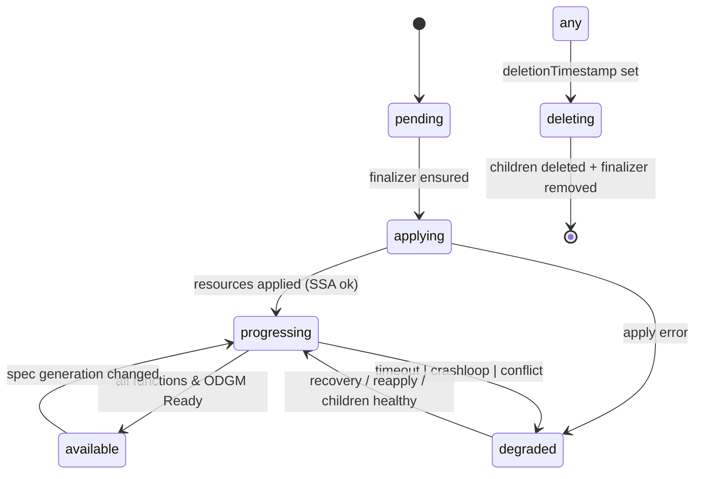

<!--
State Machine & Controller Architecture Design for OaaS CRM
-->

# OaaS Class Runtime Manager – Controller State Machine Design

This document formalizes the lifecycle management of `ClassRuntime` resources into an explicit, testable finite state machine (FSM) and supporting controller architecture. It supplements the existing `README.md` (which describes high‑level capabilities) by detailing internal flow, modules, transition rules, and extensibility points.

## 1. Goals

| Goal | Detail |
|------|--------|
| Deterministic lifecycle | Replace ad‑hoc single "progressing" phase with explicit state transitions. |
| Accurate readiness | Surface real function & ODGM readiness (Available / Degraded). |
| Non‑destructive status updates | Merge status fields (e.g. recommendations) instead of clobbering. |
| Extensible templates | Add new deployment styles without changing core controller logic. |
| Testability | Isolate pure state evaluation from K8s API side effects for unit tests. |
| Resilient deletion | Clean up all children (multi‑function, Knative) reliably via labels. |
| Clear error semantics | Map apply/conflict/timeouts/crashloops to `Degraded` with reasons. |

## 2. High‑Level Lifecycle FSM



### Phases (canonical lowercase)
* `pending` – CR observed first time; finalizer not yet attached.
* `applying` – Rendering + Server‑Side Apply (SSA) operations in flight.
* `progressing` – Waiting for child readiness (Deployments / Knative Services / Pods / ODGM).
* `available` – All declared functions Ready; ODGM (if enabled) healthy; no unmet failure conditions.
* `degraded` – Terminal or transient problem (timeout, crashloop, conflict); recovery attempts permitted.
* `deleting` – Finalizer cleanup of labeled child resources.

Conditions are maintained alongside `phase` for K8s‑style tooling:
| Type | Semantics |
|------|-----------|
| `Progressing` | True while applying or awaiting readiness. False when Available/Degraded. |
| `Available` | True only in `available`. False otherwise. |
| `Degraded` | True only in `degraded`. False otherwise. |

## 3. Core Modules

```
Reconciler (entry) -> StateEvaluator (pure) -> Actuator (side effects) -> StatusReducer (merge + patch)
                                     ^
                              Child Informers (Deployments, Pods, Knative, ODGM)
```

| Module | Responsibility | Purity |
|--------|----------------|--------|
| Reconciler | Gather CR + observed cluster state, invoke evaluator, execute actions, schedule requeues. | Orchestrator |
| StateEvaluator | Compute next state, conditions deltas, required actions, requeue hints. | Pure (no I/O) |
| Actuator | Perform K8s operations (apply, delete, patch HPA / Deployments, ensure metrics). | Side‑effect |
| StatusReducer | Merge new status fields; preserve existing recommendations, routers, applied audit trail. | Pure |
| TemplateManager | Stateless renderer producing resource manifests. | Pure |
| TemplateDescriptor | Declarative metadata guiding readiness & cleanup (resource kinds, name patterns, selectors). | Static |
| Enforcer (existing) | Replica enforcement; now routed through StatusReducer to avoid clobbering. | Side‑effect |

## 4. TemplateDescriptor Contract

Templates remain **stateless**. Each template supplies a descriptor enumerating resource semantics:

```rust
pub enum ManagedKind { Deployment, Service, KnativeService, OdgmDeployment, OdgmService, Hpa }

pub struct TemplateDescriptor {
    pub id: &'static str,
    pub managed: &'static [ManagedKind],          // kinds rendered
    pub readiness: &'static [ReadinessRule],       // evaluation functions
    pub function_namer: fn(class: &str, idx: usize, total: usize) -> String,
    pub label_selector: fn(class: &str) -> (String, String), // key,value owner label
    pub supports_odgm: bool,
}

pub struct ReadinessRule {
    pub kind: ManagedKind,
    pub evaluator: fn(&Observed) -> ReadinessResult,
    pub contributes_to_available: bool,
}

pub struct ReadinessResult {
    pub ready: bool,
    pub reason: Option<String>,
    pub message: Option<String>,
}
```

Descriptor drives:
1. Which informers to register (only relevant kinds). 
2. How to aggregate readiness (e.g., Deployment: `availableReplicas >= desired`; Knative Service: condition `Ready=True`).
3. Cleanup logic by label (no hard‑coded name assumptions). 
4. Function name predictions for per‑function status mapping.

## 5. State Evaluation Algorithm (Sketch)

Inputs:
```text
cr_spec, cr_status, observed_children, time_now, timeouts_cfg, descriptor
```
Steps:
1. Map expected children: function indices → expected names; ODGM optional.
2. Build readiness snapshot per child kind.
3. Detect anomalies: missing children, extra/orphans, crashloop (Pod conditions), conflicts (apply errors surfaced earlier), timeouts.
4. Compute target phase:
   * If deletion timestamp: `deleting`.
   * Else if apply errors: `degraded`.
   * Else if all required ready: `available`.
   * Else if timeout exceeded: `degraded`.
   * Else if previously degraded but recovery signals present: `progressing`.
   * Else: remain / enter `progressing`.
5. Form condition deltas (set boolean matrix) & per‑function readiness records.
6. Emit actions:
   * `ApplyWorkload` if generation changed or missing children.
   * `DeleteOrphans` if detected surplus.
   * `EnsureMetricsTargets` if metrics enabled & not yet ensured.
   * `EnforceReplicas` (delegated; subject to evaluator gating).
7. Suggest `requeue_after`: only when in `progressing` or `degraded` (bounded backoff). Otherwise await events.

## 6. Status Merging Rules

Preserve existing fields unless explicitly updated:
| Field | Merge Strategy |
|-------|----------------|
| `phase` | Overwrite when changed. |
| `conditions` | Upsert by `type` (replace existing entry). |
| `functions[]` | Update readiness fields by matching `function_key`. Keep predicted URL/service unchanged unless template changes. |
| `routers` | Refresh when discovery changes; else preserve. |
| `resource_refs` | Sort + dedup; diff‑based update. |
| `nfr_recommendations` | Preserve; only analyzer overwrites. |
| `last_applied_recommendations` | Preserve unless new enforcement applied. |
| `last_applied_at` | Set only on enforcement apply. |

Volatile timestamps (`lastTransitionTime`, `last_updated`) omitted from equality comparison to prevent reconcile loops.

## 7. Deletion Workflow

Phase `deleting`:
1. List all `managed` kinds for descriptor with label `oaas.io/owner=<class>`.
2. Issue delete requests (best‑effort); ignore NotFound.
3. Requeue short interval until none remain.
4. Remove finalizer; terminal.

Advantages: Works uniformly for multi‑function Knative, ODGM resources, future kinds.

## 8. Error → Degraded Mapping

| Error Source | Reason | Message Pattern |
|--------------|--------|-----------------|
| SSA conflict (409) | `Conflict` | Field manager ownership conflict applying <kind>/<name>. |
| Apply validation failure | `ApplyInvalid` | Validation failed: <detail>. |
| CrashLoopBackOff Pod | `CrashLoop` | Pod <pod> restart count=<n>. |
| Progressing timeout | `Timeout` | Readiness not achieved within <secs>. |
| Missing child | `ChildMissing` | Expected <kind>/<name> not found. |
| Orphan detected | `Orphaned` | Found unmanaged <kind>/<name>; cleanup scheduled. |

Recovery path: On next evaluation, if condition cleared (e.g., child recreated & healthy) transition `degraded -> progressing`.

## 9. Replica Enforcement Integration

Enforcer updates status **only** via StatusReducer API:
```rust
StatusReducer::apply_enforcement(dr_status, EnforcementOutcome { target, dimension, basis });
```
Reducer appends to `last_applied_recommendations` and sets `last_applied_at`. Reconcile evaluations treat enforcement outputs as opaque; they do not reset these fields.

## 9.a NFR Observe & Enforce Lifecycle (Expanded)

NFR (Non‑Functional Requirements) introduce two logical sub‑flows: observation (metrics → recommendations) and enforcement (selected dimensions applied within safety bounds). The FSM integrates these without adding new top‑level phases; instead it uses conditions and actions.

### States & NFR Interaction
| Phase | Observation | Enforcement | Notes |
|-------|-------------|-------------|-------|
| pending | Not started | Disabled | CR just discovered. |
| applying | Disabled | Disabled | Avoid interference during initial apply. |
| progressing | Passive (can record recommendations) | Optional (gated by stability) | Simpler initial impl: wait until available. |
| available | Active | Primary enforcement window | All functions healthy; safe to adjust. |
| degraded | Suspended (except for collecting recovery metrics) | Disabled (unless degraded reason is solely stale enforcement) | Prevent thrash. |
| deleting | Disabled | Disabled | Irrelevant. |

### Conditions (Additions)
| Type | Semantics |
|------|-----------|
| `NfrObserved` | At least one recommendation present in `status.nfr_recommendations`. |
| `NfrEnforced` | Latest recommendation(s) applied (replicas, etc.). |

### Recommended Condition Matrix Example
```
Phase=progressing: Progressing=True, Available=False, Degraded=False, NfrObserved? (if analyzer filled), NfrEnforced=False
Phase=available (no enforcement yet): Progressing=False, Available=True, NfrObserved=True, NfrEnforced=False
After successful enforcement: NfrEnforced=True
On enforcement failure: Degraded=True reason=EnforceFailed; NfrEnforced=False
```

### Observation Flow
1. Analyzer (metrics provider) writes `status.nfr_recommendations` (map: dimension → value). Only StatusReducer merges this field.
2. FSM sets/updates `NfrObserved` condition (transition timestamp).
3. Evaluator records stability state for dimensions (e.g., replicas) but does not apply them until criteria met.

### Enforcement Decision Algorithm (Replicas Example)
Inputs:
```
prev_target, new_target, last_change_at, cooldown_until, now,
stability_secs, cooldown_secs, max_replicas, mode (off|observe|enforce)
```
Output:
```
Decision = { Apply(target_clamped) | WaitStability | WaitCooldown | SkipMode | ResetTarget }
```
Logic (simplified):
1. If mode != enforce → `SkipMode`.
2. Clamp `new_target` to `[1, max_replicas]` (record if clamped).
3. If `prev_target != new_target`: set `last_change_at=now`; return `WaitStability`.
4. If in cooldown (`now < cooldown_until`) → `WaitCooldown`.
5. If stability window elapsed (`now - last_change_at >= stability_secs`) → `Apply(new_target)` and set `cooldown_until = now + cooldown_secs`.
6. Else `WaitStability`.

### Enforcement Action Execution (`Action::EnforceReplicas`)
Priority path:
1. HPA present & feature enabled → patch `minReplicas`.
2. Knative template → annotate revision (`autoscaling.knative.dev/minScale`).
3. Fallback → patch Deployment `spec.replicas`.
On success: append audit entry; upsert `NfrEnforced=True`.
On failure: set `Degraded=True reason=EnforceFailed message=<err>`; do not clear recommendations.

### Status Audit Trail
Each enforcement appends structured record:
```json
{
    "component": "function",
    "dimension": "replicas",
    "target": <f64>,
    "basis": "enforcer",
    "confidence": 1.0
}
```
Multiple dimensions produce multiple entries; order preserved by append (Reducer may dedup exact duplicates if desirable).

### Events (Kubernetes)
| Reason | Meaning |
|--------|---------|
| `NFRApplied` | Enforcement succeeded (already present). |
| `NFRSkippedCooldown` | Cooldown active. |
| `NFRSkippedStability` | Waiting stability window. |
| `NFRClampedMax` | Target clamped to configured max. |
| `NFRApplyFailed` | Patch failed; degraded condition set. |

### Error → Degraded Extensions
| Error | Reason | Message |
|-------|--------|---------|
| Patch 409 | `EnforceConflict` | Field manager ownership conflict applying enforcement. |
| Validation | `EnforceInvalid` | Invalid enforcement value <detail>. |
| HPA NotFound & deployment patch fails | `EnforceFallbackFailed` | Fallback path failed. |

### Multi‑Dimension Roadmap
Future dimensions: `memory`, `cpu`.
Policy examples:
* Memory: adjust container limits (Deployment template) only when usage < threshold; avoid OOM churn.
* CPU: patch resource requests/limits; coordinate with HPA metrics to avoid conflicting signals.
* ODGM replicas: future dimension with partition safety (quorum) checks before scaling.

Dimension gating table (initial):
| Dimension | Phase requirement | Extra preconditions |
|----------|------------------|---------------------|
| replicas | available | stability & cooldown satisfied |
| memory | available | analyzer confidence ≥ threshold |
| cpu | available | system load metric within safe range |
| odgm_replicas | available | partition health green; leader stable |

### Observability (Metrics)
Suggested Prometheus metrics:
* `crm_nfr_recommendation{dimension}` – gauge latest recommended value.
* `crm_nfr_enforcement_apply_total{dimension}` – counter of successful applies.
* `crm_nfr_enforcement_fail_total{reason}` – counter of failures.
* `crm_nfr_enforcement_latency_seconds` – histogram of patch round‑trip time.

### Data Consistency Guarantees
* Recommendations are **never** removed automatically; absence is meaningful (no recommendation available).
* Enforcement never deletes `nfr_recommendations`; it only appends audit entries.
* StatusReducer ensures concurrent reconcile + enforcement do not lose fields (merge by key).

### Minimal Trait Sketch
```rust
pub trait EnforcementEngine {
        fn decide(&mut self, spec: &ClassRuntimeSpec, status: &ClassRuntimeStatus, now: DateTime<Utc>) -> Option<EnforceDecision>;
        fn apply(&self, client: &Client, ns: &str, name: &str, decision: &EnforceDecision) -> anyhow::Result<()>;
}

pub enum EnforceDecision {
        Replicas { target: u32, clamped: bool },
        SkipMode,
        WaitStability,
        WaitCooldown,
}
```

FSM integrates by mapping `Replicas {..}` → `Action::EnforceReplicas(target)`; other variants produce events only.

### Migration Steps (NFR Specific)
1. Wrap existing enforcement logic with `EnforcementEngine` trait.
2. Replace direct status patch with reducer call.
3. Add `NfrObserved` / `NfrEnforced` conditions during status merges.
4. Emit new events for skips/clamps/failures.
5. Gate enforcement strictly to `available` initially; later optional enable in `progressing`.
6. Introduce metrics instrumentation.

### Risks & Mitigations
| Risk | Mitigation |
|------|-----------|
| Replica thrash | Stability + cooldown gates; optional progressive downscale. |
| Field ownership conflicts | Detect 409; record degraded condition; retry limited. |
| Analyzer stale data | Timestamp & generation check; ignore recommendations older than configurable threshold. |
| Overlapping manual edits | SSA field manager distinct (`oprc-crm-enforcer`); merge patch fallback only when safe. |

---

## 10. Testing Strategy

| Test Type | Focus |
|-----------|-------|
| Unit – Evaluator | Phase transitions (apply → progressing → available; timeouts → degraded). |
| Unit – StatusReducer | Merge idempotence; preservation of recommendations. |
| Unit – Descriptor | Name patterns, readiness rules for each template. |
| Integration – Multi function | Readiness aggregation; per-function status updates. |
| Integration – Knative delete | All Knative services removed; no orphan left. |
| Integration – Orphan cleanup | Reduce function count; old child removed. |
| Integration – Conflict handling | Simulate SSA conflict -> degraded -> recovery.
| Integration – Timeout path | Artificial delay reaching readiness -> degraded.

## 11. Migration Plan (Incremental)

1. Introduce `TemplateDescriptor` structs for existing templates (dev, edge, k8s_deployment, knative).
2. Add `Observed` aggregation layer (list children by label & kind).
3. Implement `StateEvaluator` + `StatusReducer` without changing external CRD fields.
4. Refactor `reconcile.rs` to use new flow; keep old status builder as fallback until stable.
5. Add informers for Deployments, Services, Knative Services, Pods (label filtered) – enqueue CR key on events.
6. Enable per-function readiness population; guard behind feature flag if needed for gradual rollout.
7. Integrate enforcer with StatusReducer.
8. Remove legacy status overwrite logic + delete_children special casing.
9. Expand tests; mark old tests for deletion once parity confirmed.

## 12. Open Questions / Future Extensions

| Topic | Consideration |
|-------|---------------|
| ODGM health | Add ODGM-specific readiness evaluator (e.g., gRPC health ping / partition metrics). |
| Backpressure | Degraded reasons could feed into PM scheduling heuristics. |
| Multi-cluster | Descriptor may include placement hints (future). |
| Rollouts | Progressive rollouts (percentage-based) would require sub‑states or per-function rollout phases. |
| Observability | Emit Prometheus metrics for phase transitions & condition counts. |

## 13. Glossary
* **SSA** – Server‑Side Apply: declarative apply maintaining field ownership.
* **Descriptor** – Static template metadata used to drive lifecycle evaluation.
* **Evaluator** – Pure function computing next lifecycle state.
* **Reducer** – Pure status merge stage writing deltas back safely.
* **Actuator** – Performs K8s side effects according to actions list.

## 14. Minimal Rust Skeleton (Illustrative Only)

```rust
pub enum Phase { Pending, Applying, Progressing, Available, Degraded, Deleting }

pub struct EvalInput<'a> {
    pub cr: &'a ClassRuntime,
    pub observed: &'a Observed,
    pub now: chrono::DateTime<chrono::Utc>,
    pub desc: &'a TemplateDescriptor,
    pub cfg: &'a ControllerConfig,
}

pub struct EvalOutput {
    pub phase: Phase,
    pub condition_deltas: Vec<Condition>,
    pub function_updates: Vec<FunctionStatusUpdate>,
    pub actions: Vec<Action>,
    pub requeue_after: Option<std::time::Duration>,
}

pub fn evaluate(input: EvalInput) -> EvalOutput { /* pure logic */ }

pub enum Action {
    ApplyWorkload,
    EnsureMetricsTargets,
    DeleteOrphans(Vec<ChildRef>),
    EnforceReplicas(u32),
    PatchHpaMin(u32),
}
```

*Note:* Actual implementation should reuse existing types (e.g., `ConditionType`, `FunctionStatus`) to avoid CRD churn.

## 15. Rationale Recap

Centralizing lifecycle logic in an FSM backed by descriptors:
* Reduces controller complexity (no scattering readiness rules in reconcile).
* Prevents status flicker and stale progress indicators.
* Enables confident addition of new runtime templates (e.g., future serverless engines) via new descriptors only.
* Improves debuggability (reason strings uniformly mapped). 

---

Feedback welcome. This document intentionally focuses on *controller internals*; external API surfaces remain unchanged.
