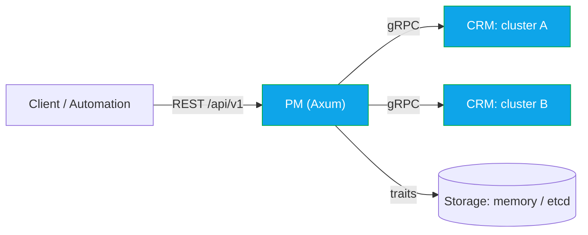

# OaaS Package Manager (PM)

PM manages OaaS packages and orchestrates class/function deployments across one or more CRM-managed clusters. It exposes a REST API (Axum) and talks to each CRM via gRPC (tonic). Storage is pluggable (memory now, etcd path sketched).

## TL;DR
- Package registry CRUD (`OPackage`).
- Deploy classes to one or more clusters (`OClassDeployment` → protobuf `DeploymentUnit`).
- Proxy class runtime and status from CRM, plus cluster health.
- Availability-aware replica planning when CRM reports `availability` (see docs).

## Quick start
- Build: `cargo build -p oprc-pm`
- Run: set `RUST_LOG=info` and optionally `CRM_DEFAULT_URL=http://localhost:8088`, then `cargo run -p oprc-pm`
- Health: GET `http://localhost:8080/health`

## Configuration (env)
Env-first via `envconfig`.

Server
- SERVER_HOST (default 0.0.0.0), SERVER_PORT (8080), SERVER_WORKERS (optional)

Storage
- STORAGE_TYPE=memory|etcd (default memory). Etcd options are wired but the factory may still be TODO.

CRM (single cluster)
- CRM_DEFAULT_URL, CRM_DEFAULT_TIMEOUT (30), CRM_DEFAULT_RETRY_ATTEMPTS (3)
- CRM_HEALTH_CHECK_INTERVAL (60), CRM_CIRCUIT_BREAKER_FAILURE_THRESHOLD (5), CRM_CIRCUIT_BREAKER_TIMEOUT (60)
- CRM_HEALTH_CACHE_TTL (15)

Multi‑CRM (simple and explicit)
- Precedence: CRM_CLUSTERS_JSON > CRM_CLUSTERS + prefixes > CRM_DEFAULT_URL
- Default cluster: CRM_DEFAULT_CLUSTER if set and defined; else a `default`-named cluster; else the first defined.

1) JSON (recommended at scale)
- CRM_CLUSTERS_JSON supports:
  - Object form: `{ "prod": { "url": "http://crm-prod:8088" }, "staging": { "url": "http://crm-stg:8088", "retry_attempts": 5 } }`
  - Array form: `[{ "name": "prod", "url": "http://crm-prod:8088", "timeout": 30, "retry_attempts": 3, "tls": {"ca_cert": "/path/ca.pem"}}]`
- Optional: CRM_DEFAULT_CLUSTER=prod

2) Env list + prefixes
- CRM_CLUSTERS=default,prod,staging,edge-eu
- Per cluster (NAME → uppercase + non-alnum → _):
  - CRM_CLUSTER_<NAME>_URL (required)
  - CRM_CLUSTER_<NAME>_TIMEOUT, CRM_CLUSTER_<NAME>_RETRY_ATTEMPTS, CRM_CLUSTER_<NAME>_API_KEY
  - CRM_CLUSTER_<NAME>_TLS_ENABLED, CRM_CLUSTER_<NAME>_TLS_CA_CERT_PATH, _TLS_CLIENT_CERT_PATH, _TLS_CLIENT_KEY_PATH, _TLS_INSECURE

Validation
- Names: [A-Za-z0-9_-]+ and unique. URL is required. TLS inferred if any TLS_* provided (unless disabled).
- Invalid configs fail fast at startup.

## HTTP API (v1)
Base: `/api/v1`
- Packages: POST/GET/GET one/POST update/DELETE under `/packages`
- Deployments: CRUD-ish endpoints under `/deployments`
- Class runtimes: `/class-runtimes`, `/class-runtimes/{id}` (aliases: `/deployment-records*`)
- Deployment status: `/deployment-status/{id}`
- Clusters: `/clusters`, `/clusters/health`, `/clusters/{name}/health`
- Catalog: `/classes`, `/functions`
- Health: `/health`

## Behavior notes
- PM sends protobuf `DeploymentUnit` (from `commons/oprc-grpc`) directly to CRM.
- Per-function `provision_config.min_scale` reflects PM’s replica planning; CRM renders K8s replicas from it.
- Availability-driven replica sizing uses quorum probability when CRM provides `availability`. Details: `docs/NFR_ENFORCEMENT_DESIGN.md`.

## Developing & tests
- Unified tasks: `just -f control-plane/justfile unit | pm-it | crm-it | all-it`
- Cargo shortcuts:
  - All PM tests: `cargo test -p oprc-pm`
  - PM↔CRM mocked/in-proc: `cargo test -p oprc-pm --test it_pm_crm -- --nocapture`

## Pointers
- Shared types: `commons/oprc-models`
- gRPC protos/clients: `commons/oprc-grpc`
- CRM flows: `control-plane/oprc-crm/README.md`
- Config code: `src/config/app.rs`
- Key modules: server (`src/server.rs`), services (`src/services`), CRM (`src/crm`)

## References
- Shared types: `commons/oprc-models`
- gRPC contracts: `commons/oprc-grpc`
- Storage traits: `commons/oprc-cp-storage`
- CRM contract and flows: `control-plane/oprc-crm/README.md`
- NFR Enforcement Design: `docs/NFR_ENFORCEMENT_DESIGN.md`
