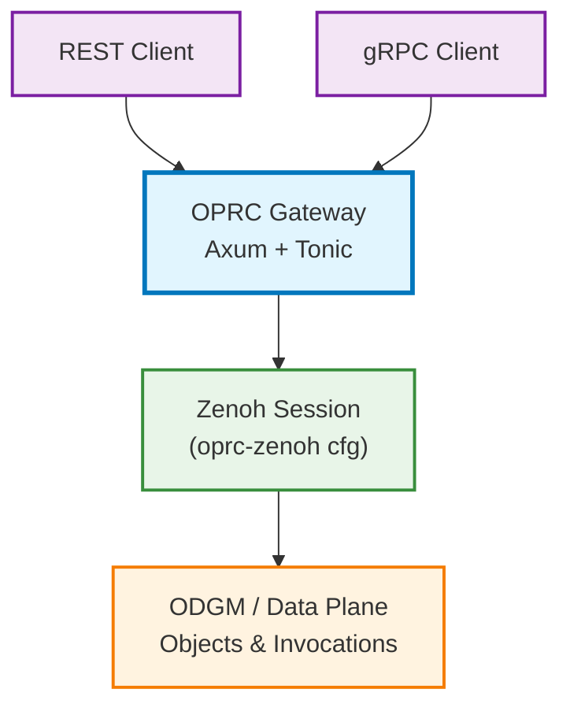

# OPRC Gateway (REST/gRPC → Zenoh Proxy)

## Overview

The OPRC Gateway is a thin, stateless ingress that maps external REST and gRPC requests directly onto the Zenoh API of the OaaS/OPRC data plane. It no longer performs outbound gRPC to function executors or package managers. Instead, it:

- Translates REST/gRPC to Zenoh keys and message types
- Handles synchronous invocations and object operations
- Returns results and status codes based on `InvocationResponse` and Zenoh outcomes

Non-goals: internal replication/Raft endpoints, async subscriptions bridging, connection pools to executors, or PM-based routing.

## Architecture



Internals
- Single Zenoh session built from `oprc-zenoh` env config.
- Minimal proxy layer: key formatting, serialization, timeouts, error/status mapping.
- Stateless by design; horizontal scaling via multiple gateway instances.

## Protocol Mapping

### REST → Zenoh

Content types
- Requests: `application/x-protobuf` (default). `application/json` is supported as an option.
- Responses: respect `Accept` if known; default to protobuf.

Options and headers
- Request options: `x-oprc-opt-<k>: <v>` or query `?opt.<k>=<v>`.
- Per-request timeout: `x-oprc-timeout-ms: <u64>`.
- Response headers: `InvocationResponse.headers` returned as `x-oprc-h-<k>: <v>`.

Endpoints and keys
- POST `/api/class/{cls}/{pid}/invokes/{method}`
  - Zenoh GET `oprc/{cls}/{pid}/invokes/{method}`
  - Body: `InvocationRequest`; Response: `InvocationResponse`

- POST `/api/class/{cls}/{pid}/objects/{oid}/invokes/{method}`
  - Zenoh GET `oprc/{cls}/{pid}/objects/{oid}/invokes/{method}`
  - Body: `ObjectInvocationRequest`; Response: `InvocationResponse`

- GET `/api/class/{cls}/{pid}/objects/{oid}`
  - Zenoh GET `oprc/{cls}/{pid}/objects/{oid}`
  - Response: `ObjData`

- PUT `/api/class/{cls}/{pid}/objects/{oid}`
  - Zenoh GET `oprc/{cls}/{pid}/objects/{oid}/set` (wait for persistence)
  - Body: `ObjData`; HTTP 204 on success

- DELETE `/api/class/{cls}/{pid}/objects/{oid}`
  - Zenoh DELETE `oprc/{cls}/{pid}/objects/{oid}`
  - Semantics: removes the object from storage; returns HTTP 204 on success

### gRPC → Zenoh

Unary RPCs that mirror the same operations. Messages come from `commons/oprc-grpc`:

- `Invoke(InvocationRequest) -> InvocationResponse`
  - Zenoh GET `oprc/{cls}/{pid}/invokes/{fn}`
- `InvokeObject(ObjectInvocationRequest) -> InvocationResponse`
  - Zenoh GET `oprc/{cls}/{pid}/objects/{oid}/invokes/{fn}`
- `GetObject(ObjMeta) -> ObjData`
  - Zenoh GET `oprc/{cls}/{pid}/objects/{oid}`
- `PutObject(ObjData) -> google.protobuf.Empty`
  - Zenoh GET `oprc/{cls}/{pid}/objects/{oid}/set`

No outbound gRPC from the gateway; it only serves gRPC and proxies via Zenoh.

## Zenoh Access Layer

`ZenohGateway` (internal helper) encapsulates the proxying logic:

- Session: `oprc_zenoh::OprcZenohConfig::init_from_env()` → `zenoh::open(...).await?`
- Methods:
  - `invoke(InvocationRequest) -> InvocationResponse`
  - `invoke_object(ObjectInvocationRequest) -> InvocationResponse`
  - `get_object(ObjMeta) -> ObjData`
  - `put_object_set(ObjData) -> ()`
  - Optional: `delete_object(ObjMeta) -> ()`
- Concurrency: bounded via semaphore (`GATEWAY_MAX_INFLIGHT`).
- Deadlines: per-call timeout with default and request override.

## Status and Error Mapping

- `InvocationResponse.status` → HTTP / gRPC:
  - `OKAY` → 200 OK / OK
  - `INVALID_REQUEST` → 400 Bad Request / INVALID_ARGUMENT
  - `APP_ERROR` → 422 Unprocessable Entity / FAILED_PRECONDITION
  - `SYSTEM_ERROR` → 502 Bad Gateway / UNAVAILABLE (or INTERNAL if non-retryable)
- Zenoh timeout → 504 Gateway Timeout / DEADLINE_EXCEEDED
- Zenoh transport error → 502 Bad Gateway / UNAVAILABLE
- Input parsing/validation → 400 Bad Request / INVALID_ARGUMENT

## Configuration

Gateway
- `HTTP_PORT` (default: 8080)
- `GRPC_PORT` (optional; if unset, gRPC is co-hosted with HTTP if supported, or disabled)
- `GATEWAY_ZENOH_TIMEOUT_MS` (default: 5000)
- `GATEWAY_MAX_INFLIGHT` (default: 1024)

Zenoh (via `oprc-zenoh`)
- `OPRC_ZENOH_MODE`, `OPRC_ZENOH_PEERS`, `OPRC_ZENOH_PORT`, etc.

Logging
- `RUST_LOG` with `tracing` (e.g., `info,oprc_gateway=debug`).

## Security & Observability

- Request IDs: propagate `x-request-id` or generate if absent.
- Tracing: structured logs with route, cls, partition, object, method, status.
- Metrics: counters and histograms per operation (optional future addition).
- TLS/mTLS: not configured by default; to be added as needed.

## Usage Examples

Protobuf (recommended)
```bash
# Invoke stateless function
curl -sS -X POST \
  http://localhost:8080/api/class/Calculator/0/invokes/add \
  -H 'Content-Type: application/x-protobuf' \
  --data-binary @invocation_request.bin

# Invoke object method
curl -sS -X POST \
  http://localhost:8080/api/class/Counter/1/objects/42/invokes/incr \
  -H 'Content-Type: application/x-protobuf' \
  --data-binary @object_invocation_request.bin

# Get object
curl -sS http://localhost:8080/api/class/Counter/1/objects/42 \
  -H 'Accept: application/x-protobuf' \
  -o objdata.bin

# Put object (persisted)
curl -sS -X PUT \
  http://localhost:8080/api/class/Counter/1/objects/42 \
  -H 'Content-Type: application/x-protobuf' \
  --data-binary @objdata.bin -D -
```

JSON (optional)
```bash
curl -sS -X POST \
  http://localhost:8080/api/class/Calculator/0/invokes/add \
  -H 'Content-Type: application/json' -H 'Accept: application/json' \
  --data '{"partition_id":0,"cls_id":"Calculator","fn_id":"add","options":{},"payload":"BASE64=="}'
```

## Migration Notes

- Removed: outbound gRPC to executors, Package Manager integration, connection pools.
- New: pure REST/gRPC → Zenoh proxy, consistent error/status mapping, env-first Zenoh session.

## Decisions

- Default content type is protobuf; JSON is optional and supported.
- REST DELETE is enabled by default and maps to Zenoh DELETE.
- No additional response header mappings beyond `x-oprc-h-*` for now.

