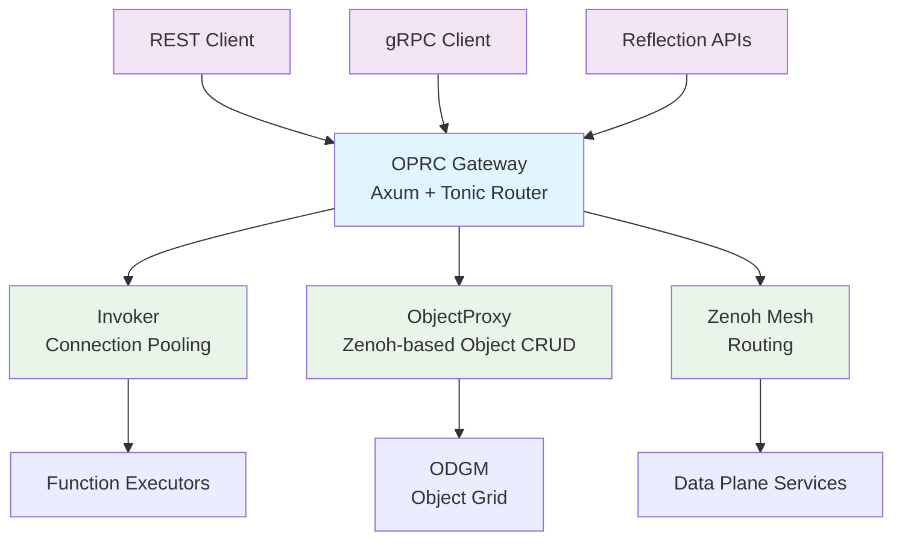

# OPRC Gateway

> ⚠️ **DEPRECATION NOTICE** ⚠️
> 
> **This crate is DEPRECATED and scheduled for a complete redesign.**
> 
> The current implementation has architectural limitations and design issues that require fundamental changes. This gateway service is being kept for compatibility purposes but should not be extended or heavily relied upon. A new gateway implementation is planned as part of the broader OaaS-RS system redesign.
> 
> For new development, please consult with the maintainers about the roadmap and consider alternative approaches.

## Overview

The OPRC Gateway (`oprc-gateway`) is a dual-protocol ingress service that provides both REST and gRPC interfaces for invoking functions and managing objects in the OaaS (Object-as-a-Service) system. It acts as the primary entry point for external clients to interact with the distributed object grid.

## Architecture

The gateway implements a unified router that serves both HTTP/REST and gRPC endpoints on the same port, leveraging Axum's routing capabilities and Tonic's gRPC server integration.



## Key Components

### Configuration (`conf.rs`)

Environment-driven configuration with the following parameters:

- `HTTP_PORT` (default: 8080) - Port for the combined HTTP/gRPC server
- `OPRC_PM_URI` (default: localhost:8081) - Package Manager URI for function discovery
- `OPRC_PRINT_POOL_INTERVAL` (default: 0) - Debug interval for connection pool state
- `OPRC_MAX_POOL_SIZE` (default: 64) - Maximum connections in the connection pool

### Error Handling (`error.rs`)

Comprehensive error types covering:
- gRPC transport and status errors
- Connection pool errors (timeout, bad connections, pool closure)
- Object/function resolution errors (class not found, function not found, etc.)
- Protobuf encoding/decoding errors
- ID parsing errors for object addressing

### Handler Layer (`handler/`)

#### REST Handler (`rest.rs`)

Provides HTTP endpoints for function and object operations:

**Function Invocation:**
- `POST /api/class/{cls}/{pid}/invokes/{func}` - Invoke a function with partition context

**Object Operations:**
- `POST /api/class/{cls}/{pid}/objects/{oid}/invokes/{func}` - Invoke a method on a specific object
- `GET /api/class/{cls}/{pid}/objects/{oid}` - Retrieve object state
- `PUT /api/class/{cls}/{pid}/objects/{oid}` - Update object state

Features a custom `Protobuf<T>` extractor/responder for seamless Protocol Buffer integration with Axum.

#### gRPC Handler (`grpc.rs`)

Implements the `OprcFunction` service with:
- `invoke_fn` - Function invocation with request routing
- `invoke_obj` - Object method invocation
- Integrated reflection services for service discovery

### Connection Management

The gateway uses the `oprc-invoke` crate's `Invoker` for:
- Connection pooling to function executors
- Automatic routing based on class, function, and partition
- Health monitoring and connection lifecycle management

### Object Proxy Integration

Direct integration with Zenoh-based `ObjectProxy` for:
- Object state retrieval and updates
- Distributed object grid access
- Real-time object synchronization

## Request Flow

### Function Invocation Flow
1. Client sends REST/gRPC request with class and function identifiers
2. Gateway extracts routing information (`Routable { cls, func, partition }`)
3. Connection manager resolves and provides a connection to appropriate executor
4. Request is forwarded to executor via gRPC
5. Response is returned and translated back to client protocol

### Object Method Invocation Flow
1. Client specifies class, partition, object ID, and method
2. Gateway constructs object-specific routing information
3. Request is routed to the partition containing the object
4. Object method is executed with current object state
5. Updated state and response are returned

### Object CRUD Flow
1. Client requests object operations via REST endpoints
2. Gateway delegates to `ObjectProxy` over Zenoh
3. Operations are performed against the distributed object grid (ODGM)
4. Results are returned in Protocol Buffer format

## Dependencies

Key dependencies include:
- **Axum** - HTTP framework with routing and middleware
- **Tonic** - gRPC server implementation with reflection
- **Zenoh** - Distributed messaging for object operations
- **oprc-invoke** - Function invocation and connection management
- **oprc-pb** - Protocol Buffer definitions for service contracts
- **mobc** - Connection pooling infrastructure

## Operational Considerations

### Performance Characteristics
- Multi-threaded Tokio runtime scaled to CPU cores
- Connection pooling with configurable limits and timeouts
- Zero-copy Protocol Buffer handling where possible

### Monitoring & Observability
- Structured logging via `tracing` with configurable levels
- Optional connection pool state reporting
- gRPC reflection for service introspection

### Limitations & Known Issues
- Limited error granularity in some failure modes
- Connection pool sizing requires manual tuning
- No built-in rate limiting or authentication
- Partition routing logic is simplified and may not handle all edge cases

## Configuration Example

```bash
# Server configuration
export HTTP_PORT=8080
export OPRC_PM_URI=localhost:8081
export OPRC_MAX_POOL_SIZE=128

# Zenoh configuration (inherited from oprc-zenoh)
export OPRC_ZENOH_MODE=peer
export OPRC_ZENOH_PEERS=tcp/10.0.0.1:7447

# Logging
export RUST_LOG=info
export OPRC_LOG=debug
```

## Usage

### Starting the Gateway

```rust
use oprc_gateway::{Config, start_server};
use envconfig::Envconfig;

#[tokio::main]
async fn main() -> Result<(), Box<dyn std::error::Error>> {
    let config = Config::init_from_env()?;
    start_server(config).await
}
```

### REST API Examples

```bash
# Invoke a function
curl -X POST http://localhost:8080/api/class/Calculator/0/invokes/add \
  -H "Content-Type: application/octet-stream" \
  --data-binary @request.bin

# Get object state
curl http://localhost:8080/api/class/Counter/1/objects/42

# Update object state
curl -X PUT http://localhost:8080/api/class/Counter/1/objects/42 \
  -H "Content-Type: application/octet-stream" \
  --data-binary @object_state.bin
```
