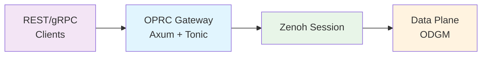

# OPRC Gateway

**A stateless ingress proxy that translates REST/gRPC requests to Zenoh operations for the OaaS data plane.**

## What it does

The gateway acts as a thin translation layer:
- **Accepts**: REST and gRPC requests from external clients
- **Translates**: Requests into Zenoh keys and messages
- **Returns**: Responses with proper HTTP/gRPC status codes

## Architecture



Key characteristics:
- **Stateless**: No internal state, horizontally scalable
- **Single Zenoh session**: Configured via environment variables
- **Minimal overhead**: Direct key formatting and serialization

## API Reference

### REST Endpoints

| Method | Path | Zenoh Operation | Description |
|--------|------|-----------------|-------------|
| POST | `/api/class/{cls}/{pid}/invokes/{method}` | GET `oprc/{cls}/{pid}/invokes/{method}` | Invoke stateless function |
| POST | `/api/class/{cls}/{pid}/objects/{oid}/invokes/{method}` | GET `oprc/{cls}/{pid}/objects/{oid}/invokes/{method}` | Invoke object method |
| GET | `/api/class/{cls}/{pid}/objects/{oid}` | GET `oprc/{cls}/{pid}/objects/{oid}` | Retrieve object |
| PUT | `/api/class/{cls}/{pid}/objects/{oid}` | GET `oprc/{cls}/{pid}/objects/{oid}/set` | Update object (persisted) |
| DELETE | `/api/class/{cls}/{pid}/objects/{oid}` | DELETE `oprc/{cls}/{pid}/objects/{oid}` | Remove object |

**Content Types**
- Default: `application/x-protobuf`
- Optional: `application/json`

**Headers & Options**
- Request options: `x-oprc-opt-<key>: <value>` or `?opt.<key>=<value>`
- Timeout: `x-oprc-timeout-ms: <milliseconds>`
- Response headers: `x-oprc-h-<key>: <value>` (from `InvocationResponse.headers`)

### gRPC Services

```protobuf
service Gateway {
  rpc Invoke(InvocationRequest) returns (InvocationResponse);
  rpc InvokeObject(ObjectInvocationRequest) returns (InvocationResponse);
  rpc GetObject(ObjMeta) returns (ObjData);
  rpc PutObject(ObjData) returns (google.protobuf.Empty);
}
```

Messages are defined in `commons/oprc-grpc`.

## Status Code Mapping

| InvocationResponse.status | HTTP Code | gRPC Code |
|--------------------------|-----------|-----------|
| OKAY | 200 | OK |
| INVALID_REQUEST | 400 | INVALID_ARGUMENT |
| APP_ERROR | 422 | FAILED_PRECONDITION |
| SYSTEM_ERROR | 502 | UNAVAILABLE |

**Additional Error Conditions**
- Zenoh timeout → 504 (HTTP) / DEADLINE_EXCEEDED (gRPC)
- Transport error → 502 (HTTP) / UNAVAILABLE (gRPC)
- Parse error → 400 (HTTP) / INVALID_ARGUMENT (gRPC)

**REST Error Format**
```json
{
  "error": {
    "code": "ERROR_CODE",
    "message": "Human-readable description"
  }
}
```

## Configuration

### Gateway Settings
| Variable | Default | Description |
|----------|---------|-------------|
| `HTTP_PORT` | 8080 | HTTP server port |
| `GRPC_PORT` | - | gRPC server port (optional) |
| `GATEWAY_ZENOH_TIMEOUT_MS` | 5000 | Request timeout |
| `GATEWAY_MAX_INFLIGHT` | 1024 | Max concurrent requests |
| `RETRY_ATTEMPTS` | 1 | Zenoh retrieval retries |
| `RETRY_BACKOFF_MS` | 25 | Retry delay |

### Zenoh Settings
Configured via `oprc-zenoh` environment variables:
- `OPRC_ZENOH_MODE`
- `OPRC_ZENOH_PEERS`
- `OPRC_ZENOH_PORT`

### Logging
- `RUST_LOG`: Standard tracing levels (e.g., `info,oprc_gateway=debug`)

## Usage Examples

### Protobuf (Recommended)

```bash
# Stateless function invocation
curl -X POST http://localhost:8080/api/class/Calculator/0/invokes/add \
  -H 'Content-Type: application/x-protobuf' \
  --data-binary @request.pb

# Object method invocation
curl -X POST http://localhost:8080/api/class/Counter/1/objects/42/invokes/incr \
  -H 'Content-Type: application/x-protobuf' \
  --data-binary @obj_request.pb

# Object retrieval
curl http://localhost:8080/api/class/Counter/1/objects/42 \
  -H 'Accept: application/x-protobuf' \
  -o object.pb

# Object update
curl -X PUT http://localhost:8080/api/class/Counter/1/objects/42 \
  -H 'Content-Type: application/x-protobuf' \
  --data-binary @object.pb
```

### JSON (Optional)

```bash
curl -X POST http://localhost:8080/api/class/Calculator/0/invokes/add \
  -H 'Content-Type: application/json' \
  -H 'Accept: application/json' \
  -d '{
    "partition_id": 0,
    "cls_id": "Calculator",
    "fn_id": "add",
    "payload": "BASE64_ENCODED_DATA"
  }'
```

## Observability

**Metrics** (OpenTelemetry)
- `http_requests_total` - Request count
- `http_request_duration_seconds` - Latency histogram
- `http_errors_total` - Error count
- `http_active_connections` - Active connection gauge

**Labels**: `http.method`, `http.route`, `http.status`

**Tracing**
- Request IDs: Propagated via `x-request-id` header
- Structured logs with context: class, partition, object, method, status

## Development

### Running Locally
```bash
RUST_LOG=debug HTTP_PORT=8080 cargo run -p oprc-gateway
```

### Testing
```bash
# Unit tests
cargo test -p oprc-gateway

# Integration tests (requires Zenoh)
just -f data-plane/justfile gateway-it
```

## Design Decisions

1. **Stateless by design** - No connection pools or internal caching
2. **Protobuf-first** - Binary format as default, JSON for compatibility
3. **Direct Zenoh mapping** - Minimal transformation logic
4. **Environment-driven config** - Standard 12-factor approach

