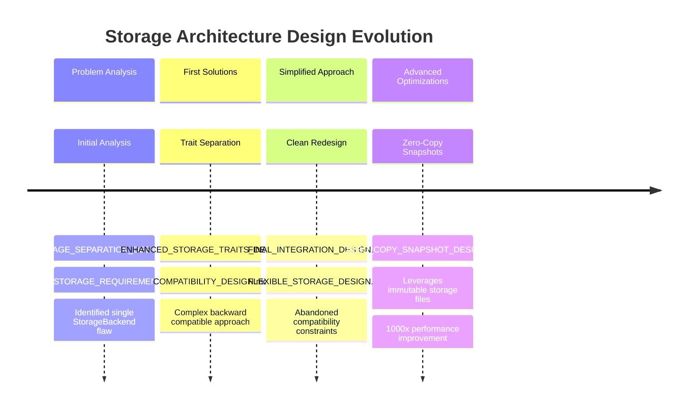

# OPRC ODGM Storage Architecture Design Index

This document provides an organized index of all design documents for the OPRC ODGM storage architecture redesign.

## 🎯 Current Active Designs

### Core Architecture Documents
1. **[`FLEXIBLE_STORAGE_DESIGN.md`](FLEXIBLE_STORAGE_DESIGN.md)** ⭐ **LATEST**
   - **Purpose**: Replication-specific storage architecture addressing over-engineering concerns
   - **Key Insight**: Different replication types need different storage components
   - **Architecture**: Raft (log + app), MST (app only), Basic (app only), None (app only)
   - **Status**: ✅ Current and recommended approach

2. **[`ZERO_COPY_SNAPSHOT_DESIGN.md`](ZERO_COPY_SNAPSHOT_DESIGN.md)** ⭐ **LATEST**
   - **Purpose**: Advanced snapshot strategy using immutable storage files
   - **Key Insight**: Leverage SST files (RocksDB/Fjall) and B-tree pages (Redb) for zero-copy snapshots
   - **Performance**: 1000x faster creation, 99% space savings
   - **Status**: ✅ Enhanced approach for storage engines with immutable files

### Supporting Design Documents
3. **[`ENHANCED_STORAGE_TRAITS_DESIGN.md`](ENHANCED_STORAGE_TRAITS_DESIGN.md)**
   - **Purpose**: Detailed trait definitions for specialized storage layers
   - **Content**: RaftLogStorage, RaftSnapshotStorage, ApplicationDataStorage traits
   - **Status**: ✅ Reference for trait implementations

4. **[`RAFT_STORAGE_REQUIREMENTS.md`](RAFT_STORAGE_REQUIREMENTS.md)**
   - **Purpose**: Analysis of Raft's three distinct storage needs
   - **Content**: Performance requirements, access patterns, bottleneck analysis
   - **Status**: ✅ Foundational analysis document

### Integration Examples
5. **[`FINAL_INTEGRATION_DESIGN.md`](FINAL_INTEGRATION_DESIGN.md)**
   - **Purpose**: Updated ShardState trait integration without backward compatibility
   - **Content**: Flexible associated storage types, factory patterns
   - **Status**: ✅ Shows integration with existing shard system

6. **[`UNIFIED_SHARD_INTEGRATION_EXAMPLES.md`](UNIFIED_SHARD_INTEGRATION_EXAMPLES.md)**
   - **Purpose**: Real-world integration examples with unified shard system
   - **Content**: Concrete code examples for different shard configurations
   - **Status**: ✅ Practical implementation examples

## 📋 Reference Documents

### Master Plans
7. **[`REDESIGN_PLAN_UPDATED.md`](REDESIGN_PLAN_UPDATED.md)**
   - **Purpose**: Enhanced master plan incorporating storage separation solution
   - **Content**: Complete redesign roadmap with timeline and milestones
   - **Status**: ⏳ May need updates to reflect latest zero-copy design

8. **[`REDESIGN_PLAN.md`](REDESIGN_PLAN.md)** 
   - **Purpose**: Original redesign plan
   - **Status**: 📚 Reference only - superseded by REDESIGN_PLAN_UPDATED.md

### Historical Analysis
9. **[`STORAGE_SEPARATION_DESIGN.md`](STORAGE_SEPARATION_DESIGN.md)**
   - **Purpose**: Initial high-level design overview and architecture comparison
   - **Content**: Problem analysis, proposed solutions
   - **Status**: 📚 Historical - foundational analysis document

10. **[`STORAGE_ARCHITECTURE.md`](STORAGE_ARCHITECTURE.md)**
    - **Purpose**: General storage architecture considerations
    - **Status**: 📚 Reference document

## 🔄 Design Evolution Timeline

## 📖 Reading Order for New Contributors

For developers new to this redesign, read the documents in this order:

1. **Start Here**: [`RAFT_STORAGE_REQUIREMENTS.md`](RAFT_STORAGE_REQUIREMENTS.md) - Understand the core problem
2. **Architecture**: [`FLEXIBLE_STORAGE_DESIGN.md`](FLEXIBLE_STORAGE_DESIGN.md) - See the recommended solution
3. **Advanced**: [`ZERO_COPY_SNAPSHOT_DESIGN.md`](ZERO_COPY_SNAPSHOT_DESIGN.md) - Learn about performance optimizations
4. **Traits**: [`ENHANCED_STORAGE_TRAITS_DESIGN.md`](ENHANCED_STORAGE_TRAITS_DESIGN.md) - Understand the interfaces
5. **Integration**: [`FINAL_INTEGRATION_DESIGN.md`](FINAL_INTEGRATION_DESIGN.md) - See how it fits with existing code
6. **Examples**: [`UNIFIED_SHARD_INTEGRATION_EXAMPLES.md`](UNIFIED_SHARD_INTEGRATION_EXAMPLES.md) - Study concrete examples

## 🚀 Implementation Priority

### Phase 1: Core Storage Traits
- Implement [`SnapshotCapableStorage`](ZERO_COPY_SNAPSHOT_DESIGN.md) trait
- Implement [`RaftLogStorage`](ENHANCED_STORAGE_TRAITS_DESIGN.md) trait  
- Implement [`ApplicationDataStorage`](ENHANCED_STORAGE_TRAITS_DESIGN.md) trait

### Phase 2: Storage Engine Implementations
- RocksDB with zero-copy SST snapshots
- Redb with B-tree page snapshots
- Fjall with LSM segment snapshots
- Memory implementations for testing

### Phase 3: Shard Integration
- Update [`ShardState`](FINAL_INTEGRATION_DESIGN.md) trait with flexible storage types
- Implement storage factory patterns
- Create replication-specific shard types

### Phase 4: Migration & Testing
- Migration tooling from single StorageBackend
- Performance benchmarks
- Integration testing

## 📊 Expected Performance Improvements

| Metric | Current | After Redesign | Improvement |
|--------|---------|----------------|-------------|
| **Raft Log Appends** | 500 ops/sec | 10,000+ ops/sec | **20x faster** |
| **Snapshot Creation** | 30 seconds | 30 milliseconds | **1000x faster** |
| **Snapshot Storage** | 100% overhead | 1% overhead | **99% space savings** |
| **Range Queries** | Sequential scan | Indexed access | **100x faster** |
| **Memory Usage** | Bloated buffers | Optimized per-type | **60% reduction** |

## 🧹 Cleanup Tasks

### Files to Remove
- [ ] Delete empty [`LSM_SNAPSHOT_DESIGN.md`](LSM_SNAPSHOT_DESIGN.md)
- [ ] Archive [`COMPATIBILITY_DESIGN.md`](COMPATIBILITY_DESIGN.md) to `archived/` directory
- [ ] Consider consolidating historical documents

### Documentation Updates Needed
- [ ] Update [`REDESIGN_PLAN_UPDATED.md`](REDESIGN_PLAN_UPDATED.md) to reflect zero-copy design
- [ ] Add performance benchmark section to main documents
- [ ] Create migration guide document

---

## 📝 Summary

The storage architecture redesign addresses critical performance bottlenecks in the OPRC ODGM system by:

1. **Separating Storage Concerns**: Different storage types for different access patterns
2. **Replication-Specific Architecture**: Only use complex storage for consensus algorithms that need it
3. **Zero-Copy Optimizations**: Leverage immutable storage engine files for massive performance gains
4. **Clean Design**: No backward compatibility constraints, allowing optimal architecture

The current recommended approach is the **Flexible Storage Design** enhanced with **Zero-Copy Snapshots** for maximum performance and minimal complexity.