# ODGM Design and Architecture (Condensed)

This document is a concise, practical overview of ODGM (Object Data Grid Manager), the Rust data-plane service in OaaS-RS. It focuses on how ODGM runs, how it stores and replicates data, how it handles events and function invocations, and how to configure and operate it.

## Purpose and Scope

- Role: Distributed object store and router for object/function workloads.
- Tech: Rust, Tokio, gRPC (tonic), Zenoh for messaging, Protobuf models, unified shard architecture.
- Replaces the Java "Invoker" with a Rust-first, performance-oriented data plane that remains compatible with the control plane.

## High-level Architecture

```mermaid
graph TB
    subgraph "🌐 External Interface"
        GRPC["🔌 gRPC Server<br/>• DataService API<br/>• OprcFunction API<br/>• Health & Reflection"]
        REST["🌍 REST Gateway<br/>• HTTP to gRPC<br/>• JSON Serialization"]
    end
    
    subgraph "🧠 Core ODGM Engine"
        META["📊 OprcMetaManager<br/>• Collection Definitions<br/>• Shard Topology<br/>• Configuration Watch"]
        
        SHARD_MGR["🔧 Shard Manager<br/>• Shard Lifecycle<br/>• Type Factory<br/>• Routing Logic"]
        
        subgraph "📦 Shard Types"
            RAFT["⚙️ Raft Shards<br/>• Strong Consistency<br/>• Leader Election<br/>• Log Replication"]
            MST["🌳 MST Shards<br/>• Merkle Tree<br/>• Sync Protocol<br/>• Conflict Resolution"]
            BASIC["💾 Basic Shards<br/>• Local Storage<br/>• No Replication<br/>• High Performance"]
        end
        
        STORAGE["💽 Storage Layer<br/>• Pluggable Backends<br/>• Memory/RocksDB/etc<br/>• Snapshot Support"]
    end
    
    subgraph "📡 Messaging & Communication"
        ZENOH["🔀 Zenoh Session Pool<br/>• Pub/Sub Messaging<br/>• Request/Response<br/>• Peer Discovery"]
        
        INV_MGR["🚀 Invocation Manager<br/>• Function Routing<br/>• Async/Sync Calls<br/>"]
        
        EVENT_SYS["⚡ Event System<br/>• Data Triggers<br/>• Function Events<br/>• Cascading Logic<br/>• Trigger Processing"]
        
        FUNC_PROXY["🔗 Function Proxy Layer<br/>• gRPC Client Pool"]
    end
    
    subgraph "🎯 Function Runtime Layer (CRM-Managed)"
        RUNTIME["🏃 Function Runtime Environment<br/>• Kubernetes Pods/Containers<br/>• Multi-language Support<br/>• Auto-scaling & Lifecycle<br/>• Resource Management"]
        
        subgraph "Function Instances"
            FUNC_A["🔧 Function Instance A<br/>• Business Logic Execution<br/>• gRPC Server Interface"]
            FUNC_B["🔧 Function Instance B<br/>• Data Transformation<br/>• gRPC Server Interface"]
            FUNC_C["🔧 Function Instance C<br/>• Event Handling Logic<br/>• gRPC Server Interface"]
        end
        
    end
    
    subgraph "🏗️ Infrastructure"
        CONFIG["⚙️ Environment Config<br/>• ODGM_* Variables<br/>• Zenoh Peers<br/>• Collection Bootstrap"]
        
        MONITORING["📈 Observability<br/>• Tracing/Logging<br/>• Metrics Export<br/>• Health Checks"]
    end
    
    %% External Connections
    REST --> GRPC
    GRPC --> META
    GRPC --> SHARD_MGR
    
    %% Core Engine Connections
    META --> SHARD_MGR
    SHARD_MGR --> RAFT
    SHARD_MGR --> MST
    SHARD_MGR --> BASIC
    RAFT --> STORAGE
    MST --> STORAGE
    BASIC --> STORAGE
    
    %% Messaging Connections
    SHARD_MGR --> ZENOH
    INV_MGR --> ZENOH
    EVENT_SYS --> ZENOH
    META --> ZENOH
    
    %% Function Integration (gRPC-based offloading)
    INV_MGR -->|gRPC Invocation<br/>Business Logic Offload| FUNC_PROXY
    FUNC_PROXY -->|Load Balanced gRPC| FUNC_A
    FUNC_PROXY -->|Load Balanced gRPC| FUNC_B
    FUNC_PROXY -->|Load Balanced gRPC| FUNC_C
    
    %% Event System triggers invocation (not direct function access)
    EVENT_SYS -->|Trigger Invocation Request| INV_MGR
    
    %% Runtime managed by CRM (abstract - not shown in detail)
    RUNTIME -.->|Manages Lifecycle| FUNC_A
    RUNTIME -.->|Manages Lifecycle| FUNC_B
    RUNTIME -.->|Manages Lifecycle| FUNC_C
    
    %% Cross-shard replication
    RAFT -.->|Replication| RAFT
    MST -.->|Sync| MST
    
    %% Infrastructure
    CONFIG --> META
    CONFIG --> ZENOH
    MONITORING -.-> GRPC
    MONITORING -.-> SHARD_MGR
    MONITORING -.-> ZENOH
    
    %% Styling
    classDef external fill:#e3f2fd,stroke:#1976d2,stroke-width:2px
    classDef core fill:#e8f5e8,stroke:#388e3c,stroke-width:2px
    classDef messaging fill:#fff3e0,stroke:#f57c00,stroke-width:2px
    classDef functions fill:#f3e5f5,stroke:#7b1fa2,stroke-width:2px
    classDef runtime fill:#e8eaf6,stroke:#3f51b5,stroke-width:2px
    classDef infrastructure fill:#fce4ec,stroke:#ad1457,stroke-width:2px
    classDef shards fill:#e0f2f1,stroke:#00695c,stroke-width:2px
    
    class GRPC,REST external
    class META,SHARD_MGR,STORAGE core
    class ZENOH,INV_MGR,EVENT_SYS messaging
    class FUNC_A,FUNC_B,FUNC_C,FUNC_PROXY functions
    class RUNTIME runtime
    class CONFIG,MONITORING infrastructure
    class RAFT,MST,BASIC shards
```



- Runtime: Tokio multi-threaded; tracing via `tracing_subscriber` with env-driven filters.
- Server: tonic gRPC server exposing DataService and OprcFunction; optional gRPC reflection.
- Messaging: Zenoh session pool for pub/sub and request/response paths (invocations, replication, events).
- Metadata: OprcMetaManager holds collections/shards definitions and watches for updates.
- Shards: Unified Shard Manager/Factory builds shards by type (raft, mst, basic/none/single).
- Storage: Pluggable `ApplicationDataStorage`; optional `SnapshotCapableStorage` for zero-copy snapshots.
- Events: Optional event system with triggers for data operations and function outcomes.
- Function Integration: ODGM offloads business logic to external function runtimes via gRPC calls. Functions are managed by CRM (Class Runtime Manager) as Kubernetes workloads but ODGM treats them as abstract gRPC endpoints. The Invocation Manager handles connection pooling, load balancing, and health monitoring for function calls.
- Event Processing: The Event System processes triggers and coordinates with the Invocation Manager to dispatch function calls. Events do not directly interact with function instances - all function communication flows through the gRPC-based Invocation Manager.

## Configuration (Environment)

Core ODGM env variables (common defaults shown):
- ODGM_HTTP_PORT: gRPC port (default 8080)
- ODGM_NODE_ID: Unique numeric/string node id
- ODGM_NODE_ADDR: Node network address (host:port)
- ODGM_MEMBERS: Cluster member list (used by replication modes like raft)
- ODGM_MAX_SESSIONS: Max Zenoh sessions (default 1)
- ODGM_REFLECTION_ENABLED: Enable gRPC reflection (default false)
- ODGM_EVENTS_ENABLED: Enable event system (default true)
- ODGM_MAX_TRIGGER_DEPTH: Max nested triggers (default 10)
- ODGM_TRIGGER_TIMEOUT_MS: Trigger timeout in ms (default 30000)
- OPRC_ZENOH_PEERS: Zenoh peer discovery (shared across services)

Bootstrap collections at startup via ODGM_COLLECTION (JSON array of CreateCollectionRequest):

```json
[
  {
    "name": "objects",
    "partition_count": 3,
    "replica_count": 2,
    "shard_type": "raft",
    "options": {
      "invoke_only_primary": "true",
      "mst_sync_interval": "5000"
    },
    "invocations": {
      "fn_routes": {
        "doSomething": {
          "url": "http://localhost:8080/invoke/doSomething"
        }
      },
      "disabled_fn": []
    }
  }
]
```

Notes:
- `options` values are strings.
- `invocations` uses `InvocationRoute` with fields:
  - `fn_routes`: map of `fn_id` -> `FuncInvokeRoute { url, stateless, standby, active_group[] }`
  - `disabled_fn`: list of disabled function IDs

## API Surface (gRPC)

- DataService (oprc-data.proto):
  - Get, GetValue, Set, SetValue, Delete, Merge, Stats
- OprcFunction (oprc-invoke.proto):
  - InvokeFn, InvokeObj
- Optional: Reflection services enabled via ODGM_REFLECTION_ENABLED.

## Collections, Shards, and Replication

- Shard types supported by the unified factory:
  - raft: Strong consistency via OpenRaft; integrates with snapshotting.
  - mst: Merkle-based anti-entropy replication with LWW conflict resolution.
  - basic, none, single: No replication variants (aliases).

Common shard options (string-valued):
- MST: `mst_sync_interval` (ms), default 5000.
- Invocation/offload: `invoke_only_primary`, `offload_max_pool_size`, `pool_max_idle_lifetime`, `pool_max_lifetime`.
- Raft: leader/initialization behavior options exist in raft modules (e.g., leader-only apply); consult raft layer for exact keys.

Shard error modes (mapped to gRPC status): NotReady, NotLeader, NoShardsFound, and storage/replication-specific errors.

## Storage Layer

- Primary trait: `ApplicationDataStorage` used by shards.
- Optional zero-copy snapshots via `SnapshotCapableStorage` for engines that support it.
- Implementations in commons/oprc-dp-storage include Memory and Fjall with `SnapshotCapableStorage` support.
- Object model in shards: `ObjectEntry` holds timestamp, node_id, fields map, and optional event metadata; serialization via serde/bincode.

## Replication Strategies

- Raft (OpenRaft):
  - Strong consistency; state machine integrates with snapshot traits.
  - Zero-copy snapshot path available when the app storage implements `SnapshotCapableStorage`.
- MST (anti-entropy + LWW):
  - Periodic publish/sync using `mst_sync_interval` (ms); default 5000.
  - Conflict resolution: Last-Writer-Wins by timestamp with deterministic tiebreaker (node_id).
  - Optional type-specific merges (e.g., CRDT via Automerge) for supported value types.
- Basic/None/Single:
  - No replication; single-writer semantics per shard partition.

## Function Runtime Integration & Invocation Offloading

ODGM delegates business logic execution to external function runtimes through a gRPC-based invocation system:

### Function Runtime Architecture
- **Function Runtimes**: Managed by CRM as Kubernetes Pods/Deployments with auto-scaling capabilities
- **Multi-language Support**: Functions can be implemented in any language that supports gRPC servers
- **Lifecycle Management**: CRM handles deployment, scaling, health monitoring, and resource allocation
- **Abstraction Layer**: ODGM treats functions as abstract gRPC endpoints, decoupled from their runtime implementation

### gRPC-Based Invocation Process
- **Invocation Manager**: Central component responsible for all function communication
- **Connection Pooling**: Maintains persistent gRPC connections with configurable pool sizes and lifetimes
- **Load Balancing**: Distributes requests across multiple function instances
- **Circuit Breaking**: Provides fault tolerance and prevents cascade failures
- **Health Monitoring**: Continuously monitors function endpoint availability

### Communication Patterns
- **Synchronous Invocation**: Direct gRPC calls for immediate responses
- **Asynchronous Processing**: Non-blocking invocation for long-running operations
- **Event-Driven Triggers**: Event system coordinates with Invocation Manager (no direct function access)

### Zenoh Integration (Internal Routing)
ODGM uses Zenoh for internal message routing between ODGM instances:
- Sync routes (Zenoh GET queryable):
  - oprc/<class>/<partition>/invokes/<fn_id>
  - oprc/<class>/<partition>/objects/*/invokes/<fn_id>
- Async routes (Zenoh PUT subscriber):
  - oprc/<class>/<partition>/invokes/<fn_id>/async/*
  - oprc/<class>/<partition>/objects/*/invokes/<fn_id>/async/*

### Configuration Options
- `invoke_only_primary`: Restrict invocations to primary shards when applicable
- `offload_max_pool_size`: Maximum gRPC connections per function endpoint
- `pool_max_idle_lifetime`: Connection idle timeout
- `pool_max_lifetime`: Maximum connection lifetime

### Key Design Principles
1. **Separation of Concerns**: ODGM handles data management; functions handle business logic
2. **Protocol Abstraction**: gRPC provides language-agnostic function interface
3. **Fault Isolation**: Function failures don't directly impact ODGM stability
4. **Scalability**: Functions can scale independently of ODGM instances
5. **Event Indirection**: All function interactions flow through the Invocation Manager

## Event System

- V2 Event Pipeline: The sole event mechanism (Bridge/object-level events removed)
- Enabled via ODGM_EVENTS_ENABLED (default true); configured by:
  - max_trigger_depth (default 10)
  - trigger_timeout_ms (default 30000)
  - enable_event_logging (default true)
  - max_concurrent_triggers (default 100)
  - payload_format (default JSON)
- Triggers fire on:
  - Per-entry data operations (create, update, delete) based on field-level changes
  - Function invocations: success => FunctionComplete, error => FunctionError (emitted by InvocationOffloader)
- Performance: All event operations complete in under 1 microsecond (see benchmarks)

## Eventing Design

This section details the V2 event model, trigger specification, payloads, and processing pipeline in ODGM.

### Concepts
- V2 Event Pipeline: Per-entry granular event system (sole event mechanism)
- Trigger: A rule attached to data or function outcomes that dispatches downstream function invocations
- Source: Either a per-entry data change (create/update/delete) or a function's completion/error
- Target: A function to invoke with context when a trigger fires
- Performance: Sub-microsecond event processing (25-334 ns per operation)

### Configuration and Controls
- Enabled via ODGM_EVENTS_ENABLED (default true).
- Limits and behavior:
  - max_trigger_depth: 10 by default (prevents infinite trigger loops).
  - trigger_timeout_ms: 30000 by default (per-trigger dispatch timeout).
  - max_concurrent_triggers: 100 by default (concurrency across in-flight triggers).
  - enable_event_logging: true by default.
  - payload_format: JSON by default (alternatives may include binary formats).

### Declaring Triggers on Objects
Attach triggers in ObjData.event when creating/updating an object. The structure mirrors the Protobuf schema:

- func_trigger: map<string, FuncTrigger>
  - Key: function id on the source object (e.g., "transcode").
  - FuncTrigger has on_complete and on_error arrays of TriggerTarget.
- data_trigger: map<uint32, DataTrigger>
  - Key: numeric field/key in the object entries.
  - DataTrigger has on_create, on_update, on_delete arrays of TriggerTarget.

Example (illustrative JSON of ObjData with triggers):

```json
{
  "metadata": { "cls_id": "Video", "partition_id": 0, "object_id": 42 },
  "entries": {
    "1": { "data": "...base64...", "type": "VAL_TYPE_BYTE" }
  },
  "event": {
    "func_trigger": {
      "transcode": {
        "on_complete": [
          { "cls_id": "Notifier", "partition_id": 0, "fn_id": "publish" }
        ],
        "on_error": [
          { "cls_id": "Notifier", "partition_id": 0, "fn_id": "alert" }
        ]
      }
    },
    "data_trigger": {
      "1": {
        "on_update": [
          { "cls_id": "Indexer", "partition_id": 0, "fn_id": "reindex" }
        ]
      }
    }
  }
}
```

TriggerTarget fields:
- cls_id: destination class id
- partition_id: destination partition
- object_id: optional destination object id (omit for function-level triggers)
- fn_id: destination function id
- req_options: optional map of request options

### Event Payloads and Types
- Event payloads are delivered as TriggerPayload:
  - event_info: includes source class/object identifiers, EventType, optional fn_id/key, timestamp, and context.
  - original_payload: optional raw bytes from the original operation (if applicable).
- EventType values include function events (complete/error) and data events (create/update/delete).

### Processing Pipeline
1) Source operation occurs (data write/merge/delete or function invoke complete/error).
2) ODGM builds EventInfo and gathers matching TriggerTargets.
3) TriggerProcessor dispatches invocations to targets using the configured payload_format.
4) Concurrency is bounded by max_concurrent_triggers; each trigger has trigger_timeout_ms.
5) Depth is tracked to avoid recursive trigger loops (max_trigger_depth).

Delivery semantics:
- Best-effort dispatch with logging. No persistent retry queue is built-in; design downstream functions to be idempotent.
- Targets are dispatched concurrently; ordering across targets is not guaranteed.

### Function Event Integration
- InvocationOffloader emits events for function outcomes:
  - EVENT_TYPE_FUNC_COMPLETE on success
  - EVENT_TYPE_FUNC_ERROR on error (with error details in context where available)
- These can drive downstream orchestration without polling.

## Observability

- Tracing via `tracing_subscriber` with env filters (e.g., ODGM_LOG, RUST_LOG).
- Prefer structured logging and add tracing in major paths (startup, shard ops, replication, events, invocations).

## Deployment and Startup

- Provide ODGM_NODE_ID, ODGM_NODE_ADDR, and OPRC_ZENOH_PEERS for networking.
- Use ODGM_COLLECTION to bootstrap collections on first start.
- For raft, ensure consistent `ODGM_MEMBERS` across nodes; for mst/basic, membership is discovered via Zenoh.
- gRPC reflection can be enabled for tooling (ODGM_REFLECTION_ENABLED=true).

## Extensibility

- Storage: Implement `ApplicationDataStorage` (+ optionally `SnapshotCapableStorage`) in `commons/oprc-dp-storage` and wire via shard inference.
- Replication: Add a new replication layer and extend the unified factory with a type discriminator.
- Events: Add new triggers/handlers; payloads are serialized per configured format.
- APIs: Extend Protobufs in `commons/oprc-grpc` and update service handlers in ODGM.

## Design notes

- Zero-copy snapshots: If the selected storage backend implements SnapshotCapableStorage, ODGM can take immutable, engine-native snapshots without copying data. Raft integrates with this to stream/apply snapshots efficiently via its state machine. This is optional; non-supporting backends still work with standard flows.
- MST replication: The MST layer periodically publishes and reconciles state using Merkle root comparisons (anti-entropy). Only divergent subtrees are exchanged. Conflicts resolve by Last-Writer-Wins using timestamps with node_id tiebreakers; specific value types may use custom/CRDT merges.
- Raft snapshot integration: With SnapshotCapableStorage, the Raft state machine builds snapshots by iterating keys from the zero-copy snapshot, producing a cursor/stream consumed by followers. Restore applies the snapshot back through the storage’s snapshot API.
- Events model: Triggers can be attached to data operations and function outcomes. InvocationOffloader emits FunctionComplete/FunctionError events with context so downstream handlers can react.

