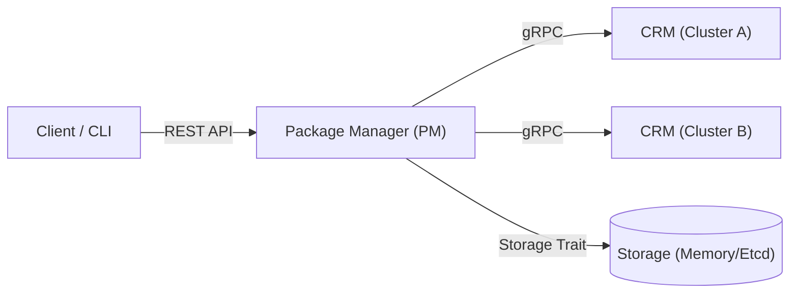
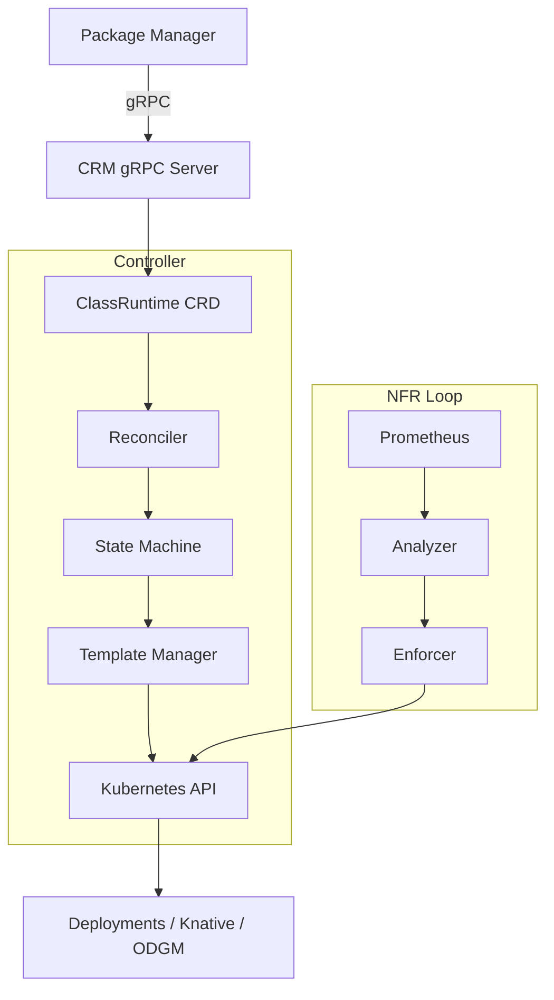

# Control Plane Architecture

The Control Plane is responsible for managing the lifecycle of OaaS Classes and Functions, handling deployments, and ensuring the system meets Non-Functional Requirements (NFRs). It consists of two main components: the Package Manager (PM) and the Class Runtime Manager (CRM).

## 1. Package Manager (PM)

**Location:** `control-plane/oprc-pm`

The Package Manager is the entry point for administrative operations. It exposes a REST API for managing packages and orchestrating deployments across one or more Kubernetes clusters.

### Key Responsibilities
*   **Package Registry**: CRUD operations for OaaS packages (`OPackage`).
*   **Multi-Cluster Orchestration**: Manages deployments across multiple CRM instances (clusters).
*   **Deployment Management**: Converts high-level deployment requests into `DeploymentUnit` protobuf messages sent to CRMs.
*   **Replica Planning**: Calculates required replicas based on availability requirements (NFRs).

### Architecture

### Configuration
PM supports multi-cluster configuration via JSON or environment variables. It can route deployments to specific clusters or a default cluster.

---

## 2. Class Runtime Manager (CRM)

**Location:** `control-plane/oprc-crm`

The CRM is a Kubernetes controller that operates within a cluster. It translates the generic OaaS deployment model into concrete Kubernetes resources.

### Key Responsibilities
*   **Kubernetes Controller**: Watches and reconciles `ClassRuntime` CRDs.
*   **Resource Management**: Creates and manages:
    *   Function Deployments & Services
    *   ODGM (Object Data Grid) Deployments & Services
    *   Knative Services (for serverless functions)
    *   Horizontal Pod Autoscalers (HPA)
*   **NFR Enforcement**: Monitors metrics (via Prometheus) and enforces NFRs (e.g., scaling, resource limits).
*   **State Machine**: Manages the lifecycle of a class runtime through explicit states (`Pending`, `Applying`, `Progressing`, `Available`, `Degraded`).

### Architecture

### Lifecycle State Machine
The CRM uses a finite state machine to ensure deterministic behavior:
*   **Pending**: CRD observed, initializing.
*   **Applying**: Rendering templates and applying resources (Server-Side Apply).
*   **Progressing**: Waiting for child resources (Pods, Services) to become ready.
*   **Available**: All functions and ODGM are ready and healthy.
*   **Degraded**: Errors encountered (crash loops, timeouts, conflicts).

### Templates
CRM uses environment-aware templates to render resources:
*   `k8s_deployment`: Standard long-running deployments.
*   `knative`: Serverless scale-to-zero services.
*   `odgm`: Dedicated Object Data Grid deployment per class.

## Interaction Flow

1.  **User** submits a deployment request to **PM** via REST/CLI.
2.  **PM** validates the request, calculates replica requirements, and selects a target cluster.
3.  **PM** sends a `Deploy` gRPC request to the target **CRM**.
4.  **CRM** creates or updates a `ClassRuntime` CRD in Kubernetes.
5.  **CRM Controller** reconciles the CRD:
    *   Renders Kubernetes manifests (Deployments, Services) based on the class definition.
    *   Applies resources to the cluster.
    *   Injects configuration (ODGM discovery, environment variables) into function pods.
6.  **CRM** updates the CRD status based on child resource health.
7.  **PM** polls or streams status from **CRM** to report back to the user.
