# NFR Enforcement Design (CRM)

This document describes how CRM implements safe, incremental enforcement of Non‑Functional Requirements (NFRs) at runtime.

> **Note**: This design is implemented in `control-plane/oprc-crm/src/controller/{analyzer,enforcer}.rs`.
> For initial replica planning based on availability NFRs, see the Package Manager (PM) logic.

## Architecture Overview

```mermaid
flowchart TB
    subgraph "📊 Metrics Collection"
        PROM["🔍 Prometheus<br/>Metrics Aggregation"]
        KUBE["☸️ Kube State Metrics<br/>Resource Status"]
    end
    
    subgraph "⚙️ CRM NFR Enforcement Engine"
        ANALYZER["📈 NFR Analyzer<br/>• Metrics Processing<br/>• Trend Analysis<br/>• Recommendation Engine"]
        ENFORCER["🎯 NFR Enforcer<br/>• Safe Scaling Logic<br/>• Cooldown Management<br/>• Bounds Checking"]
        CONFIG["⚙️ Enforcement Config<br/>• Mode: off/observe/enforce<br/>• Safety Parameters<br/>• Thresholds"]
    end
    
    subgraph "🎯 Target Resources"
        HPA["📊 HPA (Horizontal Pod Autoscaler)<br/>• minReplicas Adjustment<br/>• Burst Scaling"]
        KNATIVE["⚡ Knative Service<br/>• minScale Annotation<br/>• Serverless Scaling"]
        DEPLOY["🚀 Deployment<br/>• Direct Replica Management<br/>• Static Scaling"]
    end
    
    subgraph "💾 Storage & State"
        CRD["📋 ClassRuntime CRD<br/>• NFR Requirements<br/>• Current Status<br/>• Recommendations"]
        STATUS["📈 Status Updates<br/>• Enforcement Actions<br/>• Safety Violations<br/>• Trend Analysis"]
    end
    
    %% Data Flow
    PROM -->|RPS, CPU, Memory, Latency| ANALYZER
    KUBE -->|Resource Limits, Current Replicas| ANALYZER
    CONFIG -->|Safety Rules & Modes| ENFORCER
    CRD -->|NFR Targets| ANALYZER
    
    ANALYZER -->|Recommendations| ENFORCER
    ANALYZER -->|Observability Data| STATUS
    
    ENFORCER -->|minReplicas| HPA
    ENFORCER -->|minScale| KNATIVE
    ENFORCER -->|replicas| DEPLOY
    ENFORCER -->|Action Log| STATUS
    
    STATUS -->|Updates| CRD
    
    %% Styling
    classDef metrics fill:#e3f2fd,stroke:#1976d2,stroke-width:2px
    classDef engine fill:#e8f5e8,stroke:#388e3c,stroke-width:2px
    classDef targets fill:#fff3e0,stroke:#f57c00,stroke-width:2px
    classDef storage fill:#f3e5f5,stroke:#7b1fa2,stroke-width:2px
    
    class PROM,KUBE metrics
    class ANALYZER,ENFORCER,CONFIG engine
    class HPA,KNATIVE,DEPLOY targets
    class CRD,STATUS storage
```



## Goals
- Enforce the minimum needed replicas when a throughput NFR is provided; let autoscaling handle bursts beyond that.
- When no throughput NFR is provided, do not force replicas; instead, focus on memory tuning to reduce OOMs and waste.
- Be safe by default: stability time, cooldowns, bounded deltas, and respect user overrides.

## Modes and scope
- Enforcement mode (per ClassRuntime): off | observe | enforce (default observe).
- Dimensions: replicas (min), memory (requests/limits). CPU stays observe‑only initially (provided by user).
- When enforcement is off or metrics are unavailable, do nothing.

## Inputs and signals
- target_rps: `spec.nfr_requirements.min_throughput_rps` (optional).
- current_rps: PromQL (Knative: activator_request_count; non‑Knative: disabled for now) aggregated over a window (avg).
- cpu_mcores: sum of container CPU usage (milli‑cores) over the window (avg).
- memory_working_set_bytes: sum of working set over the window (avg).
- p99 latency (optional guard): Knative activator histogram or http server histogram (avg of p99 over window).

## Replica enforcement strategy
- If target_rps is provided, compute a minimum replicas lower bound using the measured RPS and CPU:
  - replicas_min = ceil((target_rps / current_rps) * (total_cpu_mcores / req_cpu_per_pod_m))
  - Guards:
    - Floor at 1.
    - Optional latency bump: +1 if p99_ms > threshold (default 250ms).
    - Ignore computation if current_rps ~ 0 or metrics missing.
  - req_cpu_per_pod_m default: 500m (configurable via env).
- Apply as a lower bound instead of a fixed replica count:
  - When HPA is enabled, set HPA.minReplicas = max(current minReplicas, replicas_min).
  - When Knative is enabled, set Service.spec.template.metadata.annotations[autoscaling.knative.dev/minScale] = replicas_min.
  - When autoscaling is disabled, scale the Deployment to replicas_min directly.
- Autoscaling remains in control for surges beyond replicas_min.

## Memory tuning (simple)

Goal: keep pods from OOMing while avoiding large over‑requests. Start observe‑only; enforce later behind a flag.

What we measure (per container over a window):
- avg_working_set_bytes (PromQL: container_memory_working_set_bytes)
- current request/limit (from kube‑state‑metrics)

How we recommend:
- request_bytes = round_up(max(avg_working_set_bytes * HEADROOM, 64Mi), 16Mi)
- limit_bytes   = round_up(max(request_bytes * LIMIT_FACTOR, 128Mi), 16Mi)
- Defaults: HEADROOM=1.2, LIMIT_FACTOR=1.5 (override via env OPRC_CRM_MEMORY_HEADROOM, OPRC_CRM_MEMORY_LIMIT_FACTOR)

Safeguards:
- Never go below user‑provided request/limit in the template/spec.
- Only suggest a change if delta >= 20% or absolute change >= 64Mi.
- Per‑apply bound: <= 25% change; clamp request to [64Mi, 4Gi], limit to [128Mi, 8Gi].

Presentation (status excerpt):

```
containers:
- name: function
  current: { request: 256Mi, limit: 512Mi }
  observed: { ws_avg: 110Mi, window: 6h }
  recommended: { request: 216Mi, limit: 324Mi }
  rationale: "avg*headroom; rounded"
```

Enforcement (optional, later):
- Gated by OPRC_CRM_FEATURES_NFR_ENFORCEMENT=true and per‑deployment allow.
- Apply via SSA to Deployment/Knative Service container resources only (no concurrency tuning here).
- Respect overrides; emit an Event and start cooldown after apply.

## Stability and safeguards
- Stability time: require the same recommendation (within tolerance) to be observed continuously for STABILITY_SECS before applying.
- Cooldown: after applying, wait COOLDOWN_SECS before considering further actions.
- Bounded delta: limit per‑apply change (e.g., replicas delta <= MAX_REPLICA_DELTA_PCT; memory delta <= 25%).
- Hard caps: do not exceed MAX_REPLICAS; do not set memory above MAX_MEMORY_BYTES if configured.
- User overrides: if users specify explicit resources, those take precedence and enforcement for that dimension is skipped.

## Config (env)
- OPRC_CRM_FEATURES_NFR_ENFORCEMENT=true to enable capability in profiles that default it off.
- OPRC_CRM_REQ_CPU_PER_POD_M (default 500)
- OPRC_CRM_ENFORCEMENT_STABILITY_SECS (e.g., 180)
- OPRC_CRM_ENFORCEMENT_COOLDOWN_SECS (existing; default 120)
- OPRC_CRM_ENFORCEMENT_MAX_REPLICA_DELTA (existing; %)
- OPRC_CRM_LIMITS_MAX_REPLICAS (existing)
- OPRC_CRM_MEMORY_HEADROOM (default 1.2), OPRC_CRM_MEMORY_LIMIT_FACTOR (default 1.5), optional caps

## Controller/enforcer workflow
1) Analyzer loop (M4) writes windowed recommendations with confidence and basis into `status.nfr_recommendations` and updates `NfrObserved` condition.
2) Enforcer loop (M5) runs separately:
   - Reads DeploymentRecords where `spec.nfr.enforcement.mode == enforce`.
   - Checks stability: ensure recommendations for enforced dimensions are stable for STABILITY_SECS.
   - Applies changes with SSA patches:
     - Replicas lower bound via HPA.minReplicas or Knative minScale; otherwise, scale Deployment.
     - Memory requests/limits on function (and ODGM optionally) containers.
   - Writes a Kubernetes Event and updates `status.last_applied_recommendations` (timestamp + values).
   - Starts cooldown.

## Integration details
- HPA path: create/patch an HPA if not present (respect existing target metrics). Only adjust minReplicas.
- Knative path: patch autoscaling annotations; do not set maxScale by default.
- Non‑autoscaling path: patch Deployment.spec.replicas.
- RBAC: allow patch on deployments, HPAs, and Knative Services when enabled.

## Edge cases
- Metrics unavailable or zero traffic: skip replicas enforcement; still consider memory tightening if stable.
- Burstiness/flapping: stability + cooldown prevents thrash; hysteresis on memory deltas recommended.
- Partial rollouts: read observedGeneration and only act on the latest.

## Testing plan
- Unit: replicas_min formula; memory sizing; stability window logic; delta bounding.
- Integration: wiremock Prometheus; in‑cluster envtest/kind verifying SSA patches for HPA/Deployment/Knative.
- E2E: validate that autoscaling still handles surplus while replicas_min enforces baseline.

## Future work
- CPU requests tuning with safeguards, tied to autoscaler signals.
- Admission‑webhook guardrails for user‑provided resources.
- Backoff on repeated failed applies.
