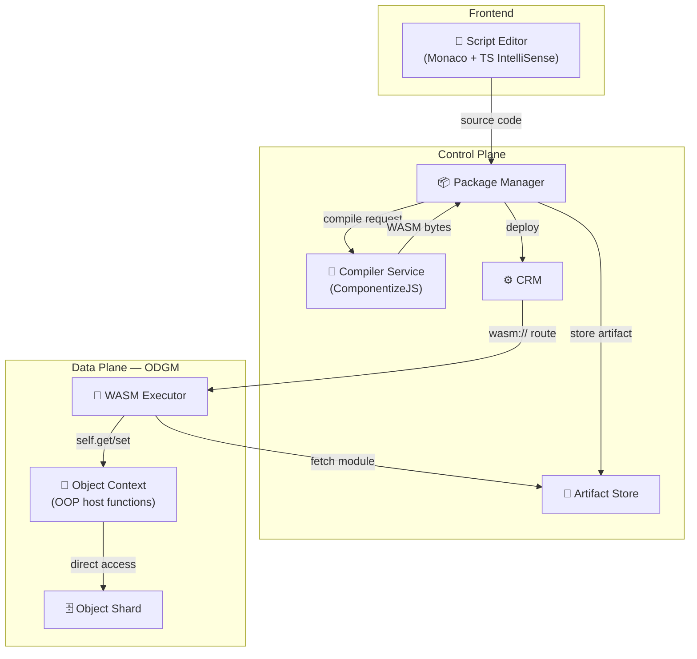
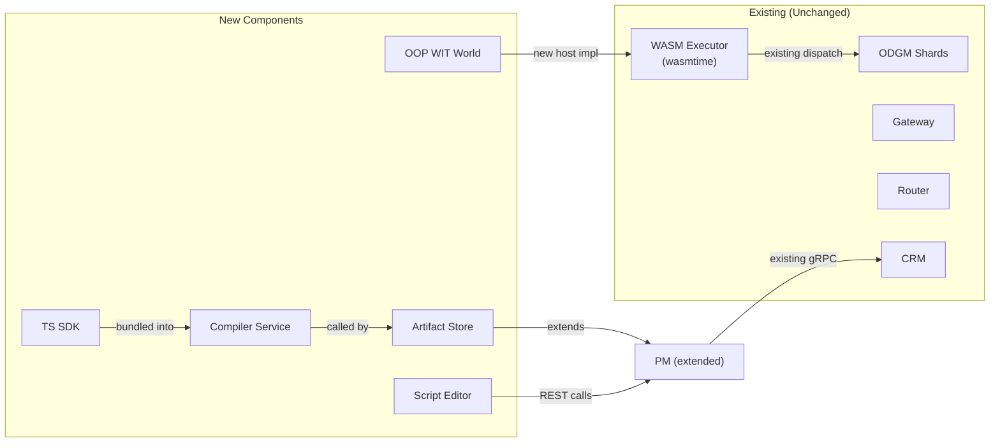

# Scripting Runtime & Frontend Editor Design

> An OOP scripting layer over the WASM runtime that lets users write TypeScript classes in a browser editor and deploy them across edge and cloud with one click.

## Motivation

The existing WASM runtime (see [WASM_RUNTIME_DESIGN.md](WASM_RUNTIME_DESIGN.md)) runs custom logic in-process inside ODGM, eliminating per-function container overhead. However, writing guest functions today is **procedural and counter-intuitive**:

- Every data access call requires explicit `cls_id`, `partition_id`, and `object_id` — information the host already knows.
- Objects are raw byte arrays (`ObjData` with `_raw` entries). No typed field access.
- There's no concept of "self" — even object-bound methods (`invoke_obj`) must manually fetch their own state.
- Guests must be compiled externally and hosted at an HTTP URL. There's no integrated authoring experience.

This design introduces three things:

1. **OOP WIT interface** — a new WIT world where the host provides implicit object context ("self"), typed field access, and structured logging.
2. **TypeScript SDK + compilation service** — users write a TypeScript class extending `OaaSObject`, which gets compiled to a WASM Component and deployed automatically.
3. **Frontend script editor** — a Monaco-based editor in the GUI with IntelliSense, one-click compile, and deploy.

## User Experience

A user opens the GUI, writes a TypeScript class, and clicks Deploy. The platform compiles it to WASM, stores the module, and rolls it out across target environments. No container image, no Dockerfile, no kubectl.

The scripting model is **class-based with implicit self**. Each method on the class maps to a function binding on the OaaS class. The SDK handles serialization, method dispatch, and host communication transparently.

```
┌─────────────────────────────────────────┐
│  Browser: Monaco Editor                 │
│                                         │
│  class Counter extends OaaSObject {     │
│    async increment(payload) {           │
│      const c = await this.get("count"); │
│      await this.set("count", c + 1);    │
│      return Response.ok({ count: c+1 });│
│    }                                    │
│  }                                      │
│                                         │
│  [ Compile ✓ ]  [ Deploy 🚀 ]          │
└─────────┬───────────────────────────────┘
          │ POST /api/v1/scripts/deploy
          ▼
┌─────────────────┐     ┌──────────────────┐
│  Package Manager │────▶│ Compiler Service  │
│  (stores module) │◀────│ (TS → WASM)      │
└────────┬────────┘     └──────────────────┘
         │ gRPC DeploymentService.Deploy
         ▼
┌─────────────────┐
│  CRM → ODGM     │  wasm:// route + module URL
│  (runs in-proc)  │
└─────────────────┘
```

## Architecture

### Component Overview



### New Components

| Component | Type | Purpose |
|-----------|------|---------|
| **OOP WIT World** (`oaas-object`) | WIT definition | Object-centric host interface with implicit context |
| **TypeScript SDK** (`@oaas/sdk`) | npm package | `OaaSObject` base class, method dispatch, field access helpers |
| **Compiler Service** (`oprc-compiler`) | Node.js service | Transpiles TS → JS, bundles with SDK, compiles to WASM Component via ComponentizeJS |
| **Artifact Store** | PM extension | Stores compiled WASM modules, serves them to ODGM via HTTP |
| **Script Editor** | Frontend page | Monaco editor with TS support, compile/deploy buttons, console output |

### Unchanged Components

The Gateway, Router, Zenoh mesh, CRM reconciliation, and ODGM shard lifecycle are **unchanged**. The new scripting layer plugs into the existing WASM runtime — it's a higher-level authoring and compilation pipeline on top of the same `wasmtime` executor.

## Part 1: OOP WIT Interface

### Problem with Current WIT

The current `oaas-function` world exposes a flat, procedural `data-access` interface:

| Current (procedural) | Problem |
|----------------------|---------|
| `get-object(cls, part, obj)` | Caller must pass cls/partition/id on every call — redundant context |
| `set-object(cls, part, obj, data)` | Same boilerplate |
| `get-value(cls, part, obj, key)` | No typed access — raw bytes everywhere |
| `invoke-fn(req)` / `invoke-obj(req)` | Two separate exports with no shared context |

### New World: `oaas-object`

The new WIT world introduces an **object-context** interface where the host holds the invocation context (cls, partition, object ID) and the guest interacts with "self" implicitly.

| Interface | Direction | Key Operations |
|-----------|-----------|----------------|
| `object-context` | Host → Guest (import) | `get-self`, `set-self`, `get-field`, `set-field`, `delete-field`, `get-object`, `invoke`, `log` |
| `guest-object` | Guest → Host (export) | `on-invoke(function-name, payload, headers) → response` |

**Design principles:**

- **Implicit context**: The host stores `cls_id`, `partition_id`, `object_id` in `WasmHostState` (already available from the `InvocationRequest`). Guest never sees these identifiers.
- **Typed field access**: `get-field(key)` and `set-field(key, value)` operate on JSON-serialized bytes. The SDK deserializes to native types.
- **Single dispatch**: Instead of two exports (`invoke-fn` / `invoke-obj`), the guest exports one `on-invoke(function-name, ...)`. The SDK routes to the matching method on the user's class.
- **Cross-object access**: `get-object(object-id)` and `invoke(target-id, fn-name, payload)` for accessing other objects — host resolves class/partition from context.
- **Structured logging**: `log(level, message)` routes guest logs into the host's `tracing` system.

### Backward Compatibility

The old `oaas-function` world remains alongside the new `oaas-object` world. The WASM executor detects which world a component targets (by checking which exports are present) and dispatches accordingly. Existing Rust-based guests continue to work without changes.

## Part 2: TypeScript SDK

### OaaSObject Base Class

The SDK provides an abstract base class that handles host communication and method dispatch:

- **`OaaSObject`** — abstract class users extend. Provides `this.get(key)`, `this.set(key, value)`, `this.delete(key)`, `this.getSelf()`, `this.invoke(targetId, fn, payload)`.
- **`Response`** — helper with static constructors: `.ok(data)`, `.error(msg)`, `.notFound()`.
- **Method dispatch** — the SDK's `on-invoke` implementation maps `function-name` to the matching method on the user's subclass via reflection (`this[functionName]`).
- **Serialization** — JSON encoding/decoding between TypeScript objects and the WIT `list<u8>` byte format.

### Why TypeScript (via ComponentizeJS)

| Option | Pros | Cons |
|--------|------|------|
| **TypeScript + ComponentizeJS** ✓ | Familiar syntax, full stdlib (JSON, String, etc.), IntelliSense in editor, Bytecode Alliance maintained | ~10-15 MB module size (embedded SpiderMonkey engine) |
| AssemblyScript | Smaller output, TS-like syntax | Incomplete stdlib, divergent semantics, smaller community |
| Rust + SDK crate | Best performance, smallest modules | Steep learning curve, not "simple scripting" |
| Custom DSL | Maximum simplicity | Requires building a language, no ecosystem |

ComponentizeJS produces real WASM Components from standard JavaScript/TypeScript, using SpiderMonkey as the embedded JS engine. Module size is larger but acceptable — modules are compiled once and cached by ODGM. For size-critical edge deployments, a future optimization could share the SpiderMonkey engine across modules.

## Part 3: Compilation Service

### Overview

A lightweight Node.js microservice that accepts TypeScript source code and returns a compiled WASM Component. It runs alongside the Package Manager and is called during the deploy workflow.

### Pipeline

```
 TypeScript source
       │
       ▼
 ┌─────────────┐
 │  TypeScript  │  tsc: TS → ES2020 JavaScript
 │  Transpiler  │
 └──────┬──────┘
        ▼
 ┌─────────────┐
 │   Bundler    │  Merge user code + SDK shim into single JS file
 └──────┬──────┘
        ▼
 ┌─────────────┐
 │ComponentizeJS│  JS + WIT → WASM Component (wasm32-wasip2)
 └──────┬──────┘
        ▼
  WASM Component bytes
```

### API

| Endpoint | Method | Input | Output |
|----------|--------|-------|--------|
| `/compile` | POST | `{ source: string, language: "typescript" }` | `{ success: bool, wasm?: bytes, errors?: string[] }` |
| `/health` | GET | — | `{ status: "ok" }` |

### Deployment

- Containerized (Node.js 20, ~100 MB image)
- Stateless — scales horizontally, no persistent storage
- Deployed via Helm chart alongside PM and CRM
- PM config: `OPRC_COMPILER_URL=http://oprc-compiler:3000`

## Part 4: Package Manager Extensions

### Artifact Storage

PM gains the ability to store compiled WASM modules and serve them to ODGM. This replaces the requirement for users to host modules on an external HTTP server.

| Concern | Approach |
|---------|----------|
| Storage backend | Local filesystem (`/data/wasm-modules/`) for MVP; S3-compatible for production |
| Addressing | Content-hash-based IDs for deduplication |
| Serving | `GET /api/v1/artifacts/{id}` — ODGM fetches from this URL |
| Retention | Tied to deployment lifecycle — cleaned up on deployment deletion |

### New REST Endpoints

| Endpoint | Purpose |
|----------|---------|
| `POST /api/v1/scripts/compile` | Compile source → return status + errors (validation only, no deployment) |
| `POST /api/v1/scripts/deploy` | Compile + store artifact + create/update package + create deployment |
| `GET /api/v1/artifacts/{id}` | Serve stored WASM module bytes to ODGM |

### Deploy Workflow

1. Frontend sends `{ source, language, class_key, function_bindings, target_envs }` to PM
2. PM forwards source to Compiler Service → receives WASM bytes
3. PM stores WASM bytes in Artifact Store → gets artifact URL
4. PM creates/updates `OPackage` with `OFunction { function_type: WASM, provision_config: { wasm_module_url: artifact_url } }`
5. PM creates `OClassDeployment` → existing flow: CRM → `wasm://` route → ODGM loads module

This means users never touch WASM URLs, package YAML, or deployment specs. The GUI abstracts it all away.

## Part 5: Frontend Script Editor

### Editor Page

A new `/scripts` route in the GUI with:

| Panel | Content |
|-------|---------|
| **Sidebar** | Function list (from packages), "New Function" button, filter/search |
| **Center** | Monaco editor with TypeScript language mode, pre-loaded `@oaas/sdk` type definitions |
| **Right** | Configuration: class name, function bindings, target environments, scaling |
| **Bottom** | Console: compilation output, errors, deployment status, invocation logs |

### Monaco Integration

Monaco is VS Code's editor engine. In the Dioxus CSR frontend, it's loaded via CDN `<script>` tag and initialized through JavaScript interop (`web_sys` / `wasm_bindgen`). The SDK type definitions are registered as extra TypeScript libs, giving users IntelliSense for `OaaSObject`, `Response`, `this.get()`, `this.set()`, etc.

### Template

New functions start with a pre-populated template so users have a working starting point they can modify.

### Workflow

1. User opens `/scripts` → sees existing functions or clicks "New"
2. Editor loads with template → user writes TypeScript class
3. User clicks **Compile** → PM validates + returns errors in console panel
4. User clicks **Deploy** → PM compiles, stores, deploys → status shown in console
5. User can invoke the function from the existing `/invoke` or `/objects` pages

## Security Considerations

| Concern | Mitigation |
|---------|------------|
| Arbitrary code execution | WASM sandbox — guest cannot access host memory, filesystem, or network directly |
| Resource exhaustion | Existing fuel metering (1B units) + epoch interruption for timeouts |
| Malicious scripts | Compiler Service runs in isolated container; compiled WASM inherits sandbox guarantees |
| Source code storage | Scripts stored as package metadata; access controlled by existing PM auth |
| Module integrity | Artifact Store uses content-hash addressing; modules immutable once stored |
| Cross-object access | Host validates object access against invocation context and class permissions |

## Relationship to Existing Components



The new components form a **layer on top** of the existing WASM runtime. The executor, shard lifecycle, Zenoh routing, CRM reconciliation, and gateway are all untouched. The only modifications to existing code are:

- **PM**: new REST endpoints + artifact storage module
- **oprc-wasm**: new WIT world + updated host implementation (additive, old world preserved)
- **Frontend**: new page + Monaco integration

## Future Extensions

- **Multi-file projects** — support imports between files, npm package resolution
- **Live preview / hot-reload** — update module without full redeployment
- **Collaborative editing** — multiple users editing the same function
- **Version history** — git-like version control for scripts
- **Test runner** — run unit tests in-browser before deploying
- **AssemblyScript backend** — alternative compiler for size-critical edge deployments
- **OCI registry** — store WASM modules in standard container registries
- **Python / Go SDKs** — additional language support via the same WIT interface
