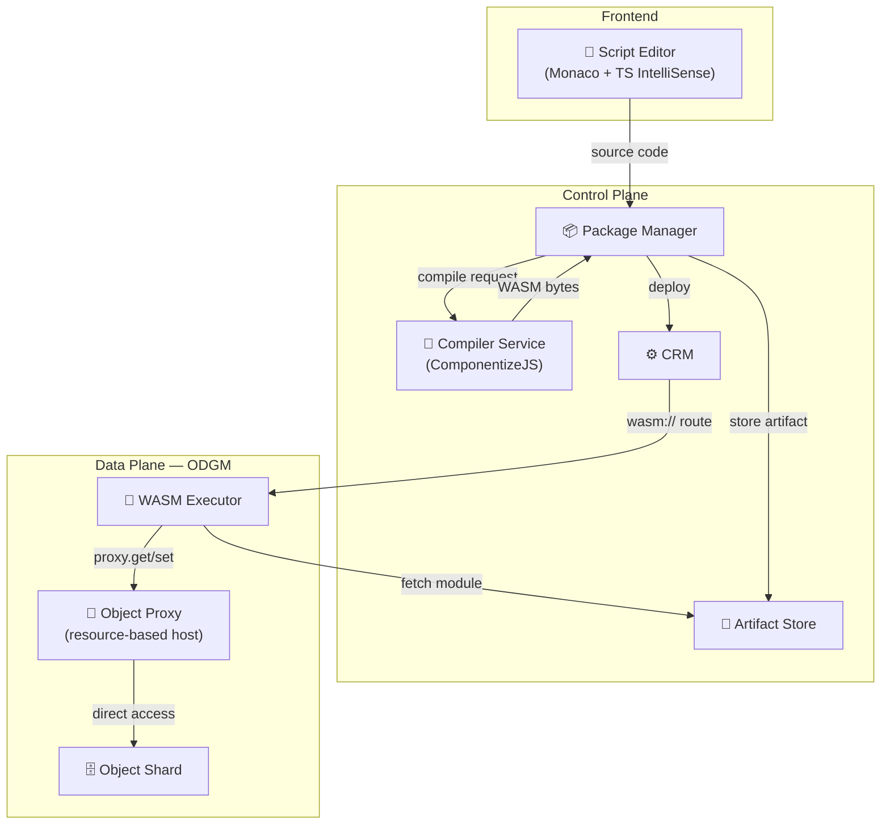
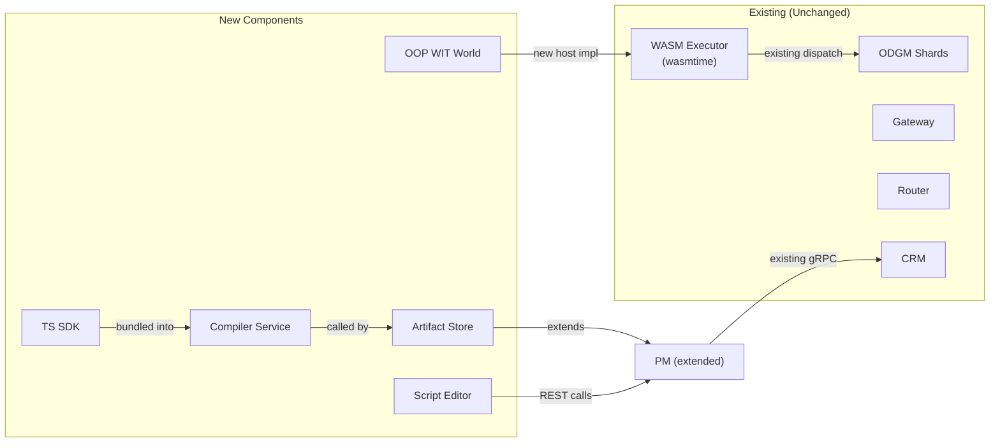

# Scripting Runtime & Frontend Editor Design

> An OOP scripting layer over the WASM runtime that lets users write TypeScript classes in a browser editor and deploy them across edge and cloud with one click.

## Motivation

The existing WASM runtime (see [WASM_RUNTIME_DESIGN.md](WASM_RUNTIME_DESIGN.md)) runs custom logic in-process inside ODGM, eliminating per-function container overhead. However, writing guest functions today is **procedural and counter-intuitive**:

- Every data access call requires explicit `cls_id`, `partition_id`, and `object_id` — information the host already knows.
- Objects are raw byte arrays (`ObjData` with `_raw` entries). No typed field access.
- There's no concept of "self" — even object-bound methods (`invoke_obj`) must manually fetch their own state.
- Guests must be compiled externally and hosted at an HTTP URL. There's no integrated authoring experience.

This design introduces three things:

1. **OOP WIT interface** — a new WIT world where the host provides implicit object context ("self"), typed field access, and structured logging.
2. **TypeScript SDK + compilation service** — users write a TypeScript class extending `OaaSObject`, which gets compiled to a WASM Component and deployed automatically.
3. **Frontend script editor** — a Monaco-based editor in the Next.js frontend (`oprc-next`) with IntelliSense, one-click compile, and deploy.

## User Experience

A user opens the frontend, writes a TypeScript class, and clicks Deploy. The platform compiles it to WASM, stores the module, and rolls it out across target environments. No container image, no Dockerfile, no kubectl.

The scripting model is **class-based with implicit self**. Each method on the class maps to a function binding on the OaaS class. The SDK handles serialization, method dispatch, and host communication transparently. Users get **proxy objects** with methods — both for `self` and for referencing other objects.

```
┌───────────────────────────────────────────────────────────┐
│  Browser: Monaco Editor                                   │
│                                                           │
│  import { service, method, OaaSObject } from "@oaas/sdk"; │
│                                                           │
│  @service("Counter", { package: "example" })              │
│  class Counter extends OaaSObject {                       │
│    count: number = 0;                                     │
│    history: string[] = [];                                │
│                                                           │
│    @method()                                              │
│    async increment(amount: number = 1): Promise<number> { │
│      this.count += amount;                                │
│      this.history.push(`Added ${amount}`);                │
│      return this.count;                                   │
│    }                                                      │
│                                                           │
│    @method()                                              │
│    async transfer(targetRef: string): Promise<void> {     │
│      const target = this.object(targetRef);               │
│      await target.invoke("receive", { from: this.ref }); │
│    }                                                      │
│  }                                                        │
│  export default Counter;                                  │
│                                                           │
│  [ Compile ✓ ]  [ Deploy 🚀 ]                            │
└─────────┬─────────────────────────────────────────────────┘
          │ POST /api/v1/scripts/deploy
          ▼
┌─────────────────┐     ┌──────────────────┐
│  Package Manager │────▶│ Compiler Service  │
│  (stores module) │◀────│ (TS → WASM)      │
└────────┬────────┘     └──────────────────┘
         │ gRPC DeploymentService.Deploy
         ▼
┌─────────────────┐
│  CRM → ODGM     │  wasm:// route + module URL
│  (runs in-proc)  │
└─────────────────┘
```

## Architecture

### Component Overview



### New Components

| Component | Type | Purpose |
|-----------|------|---------|
| **OOP WIT World** (`oaas-object`) | WIT definition | Resource-based `object-proxy` with unified `object-ref` identity |
| **TypeScript SDK** (`@oaas/sdk`) | npm package | `ObjectProxy` wrapper, `OaaSObject` base class, method dispatch |
| **Compiler Service** (`oprc-compiler`) | Node.js service | Transpiles TS → JS, bundles with SDK, compiles to WASM Component via ComponentizeJS |
| **Artifact Store** | PM extension | Stores compiled WASM modules, serves them to ODGM via HTTP |
| **Script Editor** | Frontend page | Monaco editor with TS support, compile/deploy buttons, console output |

### Unchanged Components

The Gateway, Router, Zenoh mesh, CRM reconciliation, and ODGM shard lifecycle are **unchanged**. The new scripting layer plugs into the existing WASM runtime — it's a higher-level authoring and compilation pipeline on top of the same `wasmtime` executor.

## Part 1: OOP WIT Interface

### Problem with Current WIT

The current `oaas-function` world exposes a flat, procedural `data-access` interface:

| Current (procedural) | Problem |
|----------------------|---------|
| `get-object(cls, part, obj)` | Caller must pass cls/partition/id on every call — redundant context |
| `set-object(cls, part, obj, data)` | Same boilerplate |
| `get-value(cls, part, obj, key)` | No typed access — raw bytes everywhere |
| `invoke-fn(req)` / `invoke-obj(req)` | Two separate exports with no shared context |

Additionally, object identity is scattered across three separate parameters (`cls_id`, `partition_id`, `object_id`) with no unified representation.

### Unified Object Identity: `object-ref`

An object in OaaS is uniquely identified by the triple `(class, partition, object_id)`. The new WIT defines a single record for this:

```wit
record object-ref {
    cls: string,
    partition-id: u32,
    object-id: string,
}
```

All APIs that reference objects use `object-ref` instead of passing three separate arguments. The SDK provides a convenience constructor and a string form `"cls/partition/object_id"` for easy human-readable usage.

### Resource-Based Object Proxy

Instead of flat functions, the guest receives **proxy handles** — WIT resources with methods. A proxy represents a live reference to a specific object on the shard. The host manages the proxy lifecycle.

```wit
resource object-proxy {
    // Identity
    ref: func() -> object-ref;

    // Field access (JSON-serialized bytes)
    get: func(key: string) -> result<option<list<u8>>, odgm-error>;
    get-many: func(keys: list<string>) -> result<list<field-entry>, odgm-error>;
    set: func(key: string, value: list<u8>) -> result<_, odgm-error>;
    set-many: func(entries: list<field-entry>) -> result<_, odgm-error>;
    delete: func(key: string) -> result<_, odgm-error>;

    // Full object access
    get-all: func() -> result<obj-data, odgm-error>;
    set-all: func(data: obj-data) -> result<_, odgm-error>;

    // Invoke a method on this object
    invoke: func(fn-name: string, payload: option<list<u8>>) -> result<option<list<u8>>, odgm-error>;
}

record field-entry {
    key: string,
    value: list<u8>,
}
```

The host creates an `object-proxy` by binding it to a specific `object-ref` and holding a direct reference to the underlying shard. All method calls on the proxy operate on that object — no identity parameters needed.

### New World: `oaas-object`

The new WIT world combines the proxy resource with a context interface and guest exports:

| Interface | Direction | Key Operations |
|-----------|-----------|----------------|
| `object-context` | Host → Guest (import) | `object(ref) → object-proxy`, `object-by-str(ref-str) → object-proxy`, `log(level, message)` |
| `guest-object` | Guest → Host (export) | `on-invoke(self-proxy, function-name, payload, headers) → response` |

**Design principles:**

- **Proxy-based access**: The guest receives an `object-proxy` for self and can obtain proxies for other objects. All data operations are methods on the proxy — no identity plumbing.
- **Self as parameter**: `on-invoke` receives the self proxy directly as a parameter. The host creates it from the invocation context. The guest calls `self.get("field")`, `self.set("field", value)`, etc.
- **Unified identity**: `object-ref` is a single record for the `(class, partition, object_id)` triple. A string form `"cls/partition/id"` is also accepted via `object-by-str`.
- **Batch operations**: `get-many` and `set-many` allow reading/writing multiple fields in one host call, reducing WASM↔host boundary crossings.
- **Single dispatch**: The guest exports one `on-invoke(self, function-name, ...)`. The SDK routes to the matching method on the user's class.
- **Cross-object access**: `object-context.object(ref)` returns a proxy for any accessible object. The proxy can read fields, invoke methods, etc. See [Cross-Shard Access](#cross-shard-access) for routing semantics.
- **Structured logging**: `log(level, message)` routes guest logs into the host's `tracing` system.
- **No object creation**: The proxy API operates on existing objects only. Object creation is performed externally (via Gateway or PM). This keeps the WASM sandbox simple and avoids resource lifecycle complexity.
- **`merge-object` deprecated**: The current WIT's `merge-object` (which just delegates to `set_object` + `get_object` anyway) is not carried forward. The new proxy provides `set` / `set-many` / `set-all` which cover the same use cases more explicitly.

### Cross-Shard Access

The self proxy always targets the **local shard** — fast, direct access. Cross-object proxies obtained via `object(ref)` may reference objects on **different partitions or ODGM nodes**. The host routes these transparently:

| Operation | Local object (same shard) | Remote object (different shard/node) |
|-----------|--------------------------|--------------------------------------|
| `get` / `set` / `delete` | Direct shard access | Routed via `DataService` gRPC |
| `invoke` | Re-enters shard dispatcher | Routed via Zenoh RPC (same path as Gateway → Router → ODGM) |

The `ObjectProxyState` host struct determines locality by comparing the proxy's `object-ref` against the current shard's class/partition. If local, it delegates to `OdgmDataOps` directly. If remote, it uses the existing Zenoh/gRPC infrastructure — the same paths that the Gateway and Router already use. This requires `ObjectProxyState` to hold both a local `OdgmDataOps` reference and a remote RPC client.

### Re-Entrant Invocation

When a guest calls `proxy.invoke(...)`, the host may re-enter the shard dispatcher or make a remote RPC call. Design constraints:

- **Stack depth**: Nested WASM instantiation is bounded. The host enforces a maximum re-entrant depth (e.g., 4 levels). Exceeding it returns `odgm-error::internal("max re-entrant depth exceeded")`.
- **No deadlocks**: ODGM shards use Raft apply ordering. Invocations on the same object are serialized by the Raft log. Re-entrant calls to the *same* object within a single invocation are safe because they execute within the same Raft apply context.
- **Shared fuel**: Nested invocations share the parent's fuel budget to prevent unbounded computation chains.

### Concurrency Model

ODGM serializes invocations **per object** via Raft apply ordering. Two concurrent invocations on the same object are applied sequentially — the SDK's load→mutate→save cycle is safe because only one invocation runs at a time for a given object. Cross-object operations on different objects may execute concurrently on different shards.

### Resource Ownership (WIT `own` vs `borrow`)

The `on-invoke(self: object-proxy, ...)` export passes ownership (`own<object-proxy>`) to the guest. The guest consumes the handle during the call; it is dropped when `on-invoke` returns. This is correct for the single-shot invocation model — each call gets a fresh handle. Using `borrow` would be semantically more accurate (the host retains the underlying state), but `own` is simpler for ComponentizeJS codegen and avoids lifetime complexity in the JS shim.  For cross-object proxies obtained via `object(ref)`, the same `own` semantics apply — the handle is valid for the duration of the `on-invoke` call.

### `object-ref` String Format

The convenience string form `"cls/partition/id"` uses `/` as delimiter. Constraints:
- Class names and object IDs **must not contain** `/` characters. This is enforced at the Gateway/PM level during object creation.
- Partition ID is always a numeric `u32`.
- Parsing uses the **first** and **second** `/` as split points; the remainder is the object ID (allowing object IDs to be arbitrary strings without `/`).

### Backward Compatibility

The old `oaas-function` world remains alongside the new `oaas-object` world. The WASM executor detects which world a component targets (by checking which exports are present) and dispatches accordingly. Existing Rust-based guests continue to work without changes.

## Part 2: TypeScript SDK

The SDK is modeled after the [existing Python OaaS SDK](https://github.com/hpcclab/oaas-sdk2-py) patterns — decorated classes with auto-persisted fields and natural `this.field` access — adapted for TypeScript and the WASM Component Model.

### Design: Transparent State Management

The core idea (matching the Python SDK): **type-annotated fields on the class are automatically persisted**. Users write `this.count += 1` and the SDK handles loading state from the `object-proxy` before each method call and writing changes back after. No explicit `get()` / `set()` calls needed for own fields.

Under the hood, the SDK shim:
1. Before calling the user's method: reads all declared fields from the `object-proxy` via `get-many` → deserializes JSON → sets on `this`
2. After the method returns: diffs field values → writes changes via `set-many` → serializes the return value as the invocation response
3. If the method throws: returns an error response

**Field discovery**: The shim instantiates the user's class once at module init to discover fields. `Object.keys(instance)` returns all properties with defaults — this is the field list. Only these keys are loaded/saved.

**State diff strategy**: Before calling the method, the shim JSON-serializes each field value as a snapshot. After the method returns, it re-serializes each field and compares strings. Changed fields are written via `set-many`. This correctly detects in-place mutations (e.g., `this.history.push(...)`) and is simple to implement. The cost of double-serialization is acceptable — field values are typically small.

**Stateless methods**: Methods decorated with `@method({ stateless: true })` skip the load/save cycle entirely. No `get-many` before, no `set-many` after. The method receives no object state and cannot modify persistent fields. This is equivalent to the Python SDK's stateless function — pure compute with no side effects on object state.

**Async limitation**: ComponentizeJS uses SpiderMonkey in a synchronous WASM execution context. WIT imports are blocking — they return values, not Promises. `async/await` in user methods works only when awaiting SDK-provided operations (proxy calls, `this.object()`, etc.), which are synchronous WIT calls under the hood. Arbitrary JS async APIs (`setTimeout`, `fetch`, etc.) are **not available** — there is no event loop. Methods should be declared `async` for consistency with the Python SDK but must only `await` SDK operations.

### Decorators

Following the Python SDK's `@oaas.service`, `@oaas.method` pattern:

| Decorator | Python SDK equivalent | Purpose |
|-----------|----------------------|---------|
| `@service(name, {package})` | `@oaas.service(name, package=)` | Register class as an OaaS service |
| `@method({stateless?, timeout?})` | `@oaas.method(stateless=, timeout=)` | Expose method as invocable function |
| `@getter(field?)` | `@oaas.getter(field=)` | Read-only accessor (direct field read, not exported as RPC) |
| `@setter(field?)` | `@oaas.setter(field=)` | Write accessor (direct field write, not exported as RPC) |

### OaaSObject Base Class

- **`OaaSObject`** — abstract class users extend. Provides:
  - Type-annotated fields → auto-persisted state (loaded/saved around each method call)
  - `this.ref: ObjectRef` — own identity
  - `this.object(ref: ObjectRef | string): ObjectProxy` — get a proxy to another object
  - `this.log(level, message)` — structured logging to host tracing
- **`ObjectProxy`** — handle for cross-object access (wraps WIT `object-proxy` resource):
  - `get<T>(key): Promise<T | null>` — read a field
  - `getMany<T>(...keys): Promise<Record<string, T>>` — batch read
  - `set<T>(key, value): Promise<void>` — write a field
  - `setMany(entries): Promise<void>` — batch write
  - `invoke(fnName, payload?): Promise<any>` — call a method on this object
  - `ref: ObjectRef` — the object's identity
- **`ObjectRef`** — unified identity: `{ cls, partitionId, objectId }`. Constructors: `ObjectRef.from(cls, partition, id)` and `ObjectRef.parse("cls/partition/id")`.

### Return Values & Error Handling

Like the Python SDK, methods **return plain values** — not wrapped in `Response` objects. The SDK serializes the return value as the invocation response payload. Errors are conveyed by throwing:

- Return a value → SDK wraps as `status: okay` with JSON-serialized payload
- Throw `OaaSError(message)` → SDK wraps as `status: app-error`
- Throw anything else → SDK wraps as `status: system-error`

### Type System

Supported field/param/return types (JSON-serialized):
- Primitives: `number`, `string`, `boolean`
- Collections: `Array<T>`, `Record<string, T>`, `Map`, `Set`
- Structured: plain objects, interfaces
- Optional: `T | null`, `T | undefined`
- Nested: arbitrarily nested combinations of the above

### Cross-Object References

Like the Python SDK's `ObjectRef` and `ref()`, services can hold references to other objects as typed fields:

```typescript
@service("User", { package: "social" })
class User extends OaaSObject {
  name: string = "";
  profileRef: ObjectRef | null = null;

  @method()
  async linkProfile(ref: string): Promise<void> {
    this.profileRef = ObjectRef.parse(ref);
  }

  @method()
  async getProfileData(): Promise<any> {
    if (!this.profileRef) return null;
    const profile = this.object(this.profileRef);
    return await profile.invoke("getData");
  }
}
```

### Comparison with Python SDK

| Feature | Python SDK | TypeScript SDK (this design) |
|---------|-----------|-----------------------------|
| Service registration | `@oaas.service("Name", package="pkg")` | `@service("Name", { package: "pkg" })` |
| Method export | `@oaas.method()` | `@method()` |
| State access | `self.count += 1` | `this.count += 1` |
| Auto-persistence | ✓ (descriptors) | ✓ (load-before / save-after shim) |
| Return values | Plain values | Plain values |
| Cross-object ref | `ref(cls_id, obj_id)` | `ObjectRef.from(cls, part, id)` |
| Remote call | `await proxy.method(arg)` | `await proxy.invoke("method", arg)` |
| Package export | `oaas.print_pkg()` | Generated from decorators at compile time |
| Accessors | `@oaas.getter` / `@oaas.setter` | `@getter` / `@setter` |
| Stateless functions | `@oaas.function()` | `@method({ stateless: true })` |
| Runtime | Python + gRPC | WASM Component (in-process in ODGM) |

### Why TypeScript (via ComponentizeJS)

| Option | Pros | Cons |
|--------|------|------|
| **TypeScript + ComponentizeJS** ✓ | Familiar syntax, full stdlib (JSON, String, etc.), IntelliSense in editor, Bytecode Alliance maintained | ~10-15 MB module size (embedded SpiderMonkey engine) |
| AssemblyScript | Smaller output, TS-like syntax | Incomplete stdlib, divergent semantics, smaller community |
| Rust + SDK crate | Best performance, smallest modules | Steep learning curve, not "simple scripting" |
| Custom DSL | Maximum simplicity | Requires building a language, no ecosystem |

ComponentizeJS produces real WASM Components from standard JavaScript/TypeScript, using SpiderMonkey as the embedded JS engine. Module size is larger but acceptable — modules are compiled once and cached by ODGM. For size-critical edge deployments, a future optimization could share the SpiderMonkey engine across modules.

## Part 3: Compilation Service

### Overview

A lightweight Node.js microservice that accepts TypeScript source code and returns a compiled WASM Component. It runs alongside the Package Manager and is called during the deploy workflow.

### Pipeline

```
 TypeScript source
       │
       ▼
 ┌─────────────┐
 │  TypeScript  │  tsc: TS → ES2020 JavaScript
 │  Transpiler  │
 └──────┬──────┘
        ▼
 ┌─────────────┐
 │   Bundler    │  Merge user code + SDK shim into single JS file
 └──────┬──────┘
        ▼
 ┌─────────────┐
 │ComponentizeJS│  JS + WIT → WASM Component (wasm32-wasip2)
 └──────┬──────┘
        ▼
  WASM Component bytes
```

### API

| Endpoint | Method | Input | Output |
|----------|--------|-------|--------|
| `/compile` | POST | `{ source: string, language: "typescript" }` | On success: `application/wasm` binary. On error: `{ success: false, errors: string[] }` JSON |
| `/health` | GET | — | `{ status: "ok" }` |

The compile endpoint returns raw WASM bytes directly (not base64-encoded in JSON) to avoid bloating 10-15 MB modules into ~20 MB JSON payloads. The PM receives the binary response and stores it in the artifact store.

### Deployment

- Containerized (Node.js 20, ~100 MB image)
- Stateless — scales horizontally, no persistent storage
- Deployed via Helm chart alongside PM and CRM
- PM config: `OPRC_COMPILER_URL=http://oprc-compiler:3000`

## Part 4: Package Manager Extensions

### Artifact Storage

PM gains the ability to store compiled WASM modules and serve them to ODGM. This replaces the requirement for users to host modules on an external HTTP server.

| Concern | Approach |
|---------|----------|
| Storage backend | Local filesystem (`/data/wasm-modules/`) for MVP; S3-compatible for production |
| Addressing | Content-hash-based IDs for deduplication |
| Serving | `GET /api/v1/artifacts/{id}` — ODGM fetches from this URL |
| Retention | Tied to deployment lifecycle — cleaned up on deployment deletion |

### New REST Endpoints

| Endpoint | Purpose |
|----------|---------|
| `POST /api/v1/scripts/compile` | Compile source → return status + errors (validation only, no deployment) |
| `POST /api/v1/scripts/deploy` | Compile + store artifact + store source + create/update package + create deployment |
| `GET /api/v1/scripts/{package}/{function}` | Retrieve stored source code for re-editing in the frontend |
| `GET /api/v1/artifacts/{id}` | Serve stored WASM module bytes to ODGM |

### Deploy Workflow

1. Frontend sends `{ source, language, class_key, function_bindings, target_envs }` to PM
2. PM forwards source to Compiler Service → receives WASM bytes
3. PM stores WASM bytes in Artifact Store → gets artifact URL
4. PM **stores original source code** alongside the package/function metadata (for later re-editing)
5. PM creates/updates `OPackage` with `OFunction { function_type: WASM, provision_config: { wasm_module_url: artifact_url } }`
6. PM creates `OClassDeployment` → existing flow: CRM → `wasm://` route → ODGM loads module

This means users never touch WASM URLs, package YAML, or deployment specs. The GUI abstracts it all away.

### Source Code Persistence

The original TypeScript source is stored in PM alongside the compiled artifact. This enables re-editing: when a user opens an existing function in the Script Editor, the frontend fetches the source from `GET /api/v1/scripts/{package}/{function}`. Without this, deployed functions would be opaque WASM blobs with no way to view or modify the original code.

Source is stored as a field on the `OFunction` model (e.g., `source_code: Option<String>`) or in a separate source storage alongside the artifact store.

## Part 5: Frontend Script Editor

### Editor Page

A new `/scripts` route in the GUI with:

| Panel | Content |
|-------|---------|
| **Sidebar** | Function list (from packages), "New Function" button, filter/search |
| **Center** | Monaco editor with TypeScript language mode, pre-loaded `@oaas/sdk` type definitions |
| **Right** | Configuration: class name, function bindings, target environments, scaling |
| **Bottom** | Console: compilation output, errors, deployment status, invocation logs |

### Monaco Integration

Monaco is VS Code's editor engine. In the Next.js frontend (`oprc-next`), it's integrated via `@monaco-editor/react`. The SDK type definitions are registered as extra TypeScript libs, giving users IntelliSense for `OaaSObject`, `@service`, `@method`, `this.object()`, field types, etc.

### Template

New functions start with a pre-populated template matching the SDK patterns:

```typescript
import { service, method, OaaSObject } from "@oaas/sdk";

@service("MyService", { package: "default" })
class MyService extends OaaSObject {
  // Declare fields → auto-persisted
  value: number = 0;

  @method()
  async handle(input: any): Promise<any> {
    // Your logic here — use this.value, this.object(), etc.
    return { result: this.value };
  }
}
export default MyService;
```

### Workflow

1. User opens `/scripts` → sees existing functions (source loaded from PM) or clicks "New"
2. Editor loads with template (new) or stored source (existing) → user writes TypeScript class
3. User clicks **Compile** → PM validates + returns errors in console panel
4. User clicks **Deploy** → PM compiles, stores artifact + source, deploys → status shown in console
5. User can invoke the function from the existing `/invoke` or `/objects` pages
6. User can re-open any deployed function → source loaded from `GET /api/v1/scripts/{pkg}/{fn}` → edit and redeploy

## Security Considerations

| Concern | Mitigation |
|---------|------------|
| Arbitrary code execution | WASM sandbox — guest cannot access host memory, filesystem, or network directly |
| Resource exhaustion | Existing fuel metering (1B units, shared across re-entrant calls) + epoch interruption for timeouts |
| Malicious scripts | Compiler Service runs in isolated container; compiled WASM inherits sandbox guarantees |
| Source code storage | Scripts stored as package metadata; access controlled by existing PM auth |
| Module integrity | Artifact Store uses content-hash addressing; modules immutable once stored |
| Cross-object access | Host validates object access against invocation context and class permissions |
| Re-entrant depth | Maximum nesting depth enforced by host (default: 4 levels) |
| Module store memory | `WasmModuleStore` enforces a configurable capacity limit with LRU eviction for compiled modules |

## Technical Constraints & Limitations

| Constraint | Detail |
|------------|--------|
| **Async in WASM** | User methods may only `await` SDK-provided operations (proxy calls). No `setTimeout`, `fetch`, or arbitrary JS async APIs — no event loop in SpiderMonkey-WASM context. |
| **No object creation** | WASM guests cannot create new objects. Object lifecycle is managed externally (Gateway, PM). |
| **`object-ref` format** | Class names and object IDs must not contain `/`. Partition ID is numeric. |
| **Module size** | ComponentizeJS modules are 10-15 MB raw (embedded SpiderMonkey). Pre-compiled wasmtime representations may be larger. Module store uses capacity-limited cache with LRU eviction. |
| **Wasmtime compatibility** | ComponentizeJS output must target a Component Model version compatible with the project's `wasmtime` version. A compatibility test (compile trivial TS → load in wasmtime) is part of the verification checklist. |
| **Field key routing** | Proxy `get`/`set` field keys map directly to shard entry keys via `get_entry_granular(id, key)` / `set_entry_granular(id, key, value)`. The old `_raw` blob convention is not used — each field is a separate granular entry. |
| **`merge-object` removed** | Not carried forward from old WIT. Use `set` / `set-many` / `set-all` instead. |

## Relationship to Existing Components



The new components form a **layer on top** of the existing WASM runtime. The executor, shard lifecycle, Zenoh routing, CRM reconciliation, and gateway are all untouched. The only modifications to existing code are:

- **PM**: new REST endpoints + artifact storage module
- **oprc-wasm**: new WIT world with `object-proxy` resource + host implementation (additive, old world preserved)
- **Frontend**: new `/scripts` page + Monaco integration in `oprc-next`

## Future Extensions

- **Multi-file projects** — support imports between files, npm package resolution
- **Live preview / hot-reload** — update module without full redeployment
- **Collaborative editing** — multiple users editing the same function
- **Version history** — git-like version control for scripts
- **Test runner** — run unit tests in-browser before deploying
- **AssemblyScript backend** — alternative compiler for size-critical edge deployments
- **OCI registry** — store WASM modules in standard container registries
- **Python / Go SDKs** — additional language support via the same WIT interface
