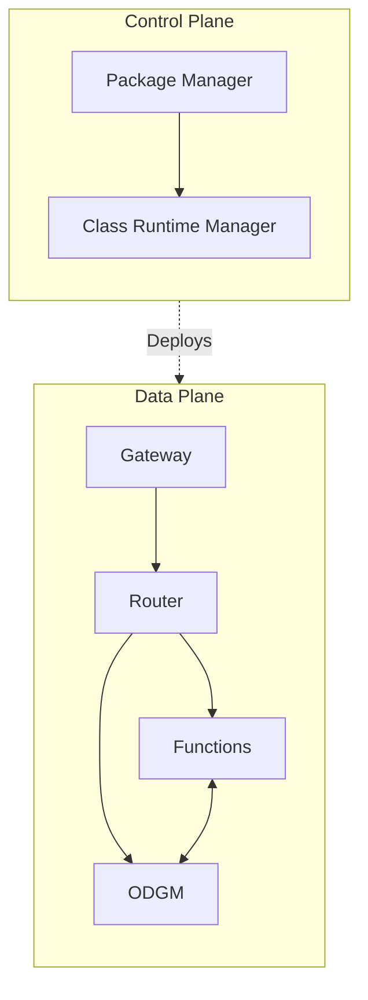

# OaaS-RS Technical Overview

This documentation covers the technical architecture of the OaaS-RS (Object-as-a-Service) platform. The system is divided into two main planes: the Control Plane and the Data Plane.

## Architecture Map

## Documentation Sections

### [Control Plane Architecture](CONTROL_PLANE.md)
Details the management layer of the platform.
*   **Package Manager (PM)**: REST API, Multi-cluster orchestration.
*   **Class Runtime Manager (CRM)**: Kubernetes Controller, CRDs, NFR Enforcement.

### [Data Plane Architecture](DATA_PLANE.md)
Details the execution and storage layer.
*   **Gateway**: Ingress and protocol translation.
*   **Router**: Zenoh-based messaging mesh.
*   **ODGM**: Distributed Object Data Grid.

### [ODGM Features & Internals](ODGM_FEATURES.md)
Deep dive into specific features of the Object Data Grid Manager.
*   **String-Based Object IDs**: Human-readable addressing.
*   **Granular Storage**: Per-entry persistence.
*   **Reactive Event System**: Reactive event system.

### Design Documents
*   [NFR Enforcement Design](NFR_ENFORCEMENT_DESIGN.md): How the system handles Non-Functional Requirements like scaling and availability.
*   [OpenTelemetry Design](OPENTELEMETRY_DESIGN.md): Observability, metrics, and tracing strategy.
