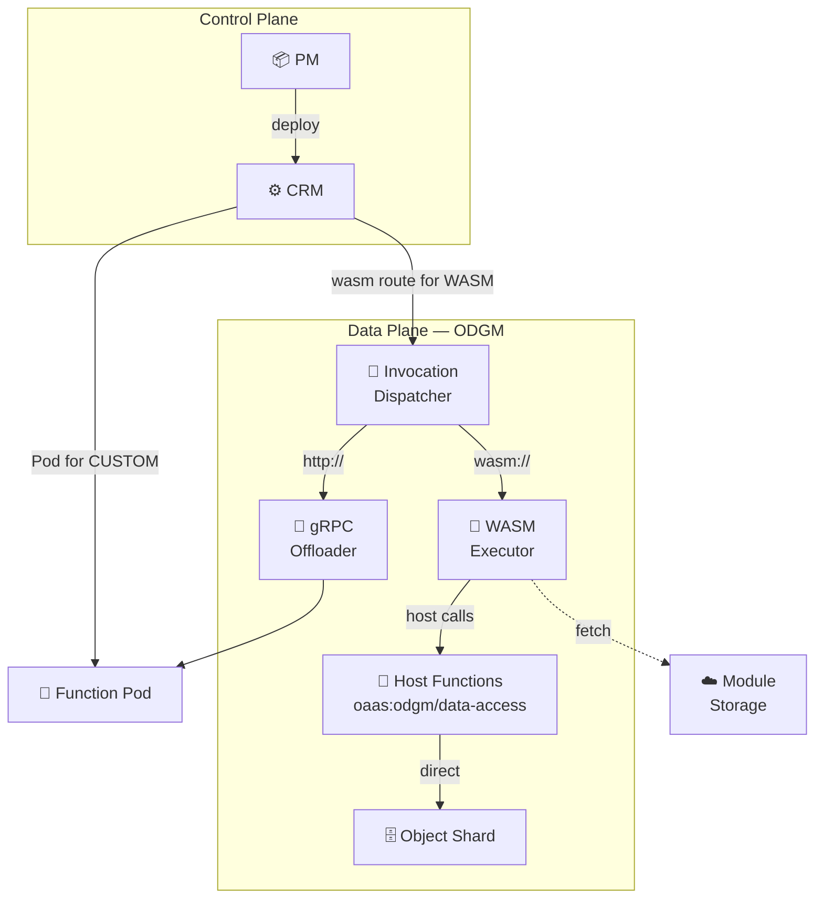

# WASM Runtime Integration Design

> Run custom function logic in-process inside ODGM using WASI Component Model, with direct access to object data.
>
> Two invocation modes: **stateless functions** (class-scoped compute) and **object methods** (object-bound logic with implicit context).

## Motivation

Today every custom function runs as an **external gRPC server** in its own Kubernetes Pod. ODGM offloads invocations via gRPC `InvocationOffloader`. This works but carries per-function overhead: container image, K8s Deployment, Service, network hop.

For lightweight or data-intensive functions the overhead dominates. A WASM runtime embedded in ODGM eliminates it — functions execute in-process with direct shard access, while still coexisting with the existing gRPC model.

## Architecture

**Key idea**: the `InvocationOffloader` dispatches by URL scheme. Routes with `wasm://` go to the embedded WASM executor; routes with `http://` follow the existing gRPC path. Everything downstream (Zenoh routing, events) is unchanged.

## Two Invocation Modes

OaaS has two distinct invocation types, both supported in WASM:

| | Stateless Function | Object Method |
|---|---|---|
| **Trigger** | `InvokeFn` (no object) | `InvokeObj` (bound to object) |
| **Zenoh route** | `oprc/<cls>/<part>/invokes/<fn>` | `oprc/<cls>/<part>/objects/<obj>/invokes/<fn>` |
| **Guest export** | `invoke-fn(req)` | `invoke-obj(req)` |
| **Object context** | None — must explicitly call `data-access` if needed | Implicit `object_id` in request; host auto-scopes data access |
| **Use case** | Stateless compute, ETL, aggregation | Per-object business logic, state mutations |
| **Existing trait** | `InvocationExecutor::invoke_fn` | `InvocationExecutor::invoke_obj` |

## WASI Component Model & WIT Interface

Guest functions are compiled as **WASI components** (`wasm32-wasip2` target) and interact with ODGM through a typed WIT contract.

### World: `oaas-function`

| Direction | Interface | Purpose |
|-----------|-----------|--------|
| **Guest imports** (from host) | `oaas:odgm/data-access` | Read/write objects and entries on the local shard |
| **Guest exports** (to host) | `oaas:odgm/guest-function` | Entry points ODGM calls for stateless or object-bound invocations |

### Host-Provided Data Access (`data-access`)

These map 1-to-1 onto existing ODGM shard operations:

| WIT Function | ODGM Internal | Proto Equivalent |
|---|---|---|
| `get-object(cls, part, obj)` | `ObjectUnifiedShard::get_object` | `DataService::Get` |
| `set-object(cls, part, obj, data)` | `ObjectUnifiedShard::set_object` | `DataService::Set` |
| `delete-object(cls, part, obj)` | `ObjectUnifiedShard::delete_object` | `DataService::Delete` |
| `merge-object(cls, part, obj, data)` | merge via `set_object` | `DataService::Merge` |
| `get-value(cls, part, obj, key)` | `EntryStore::get_value` | `DataService::GetValue` |
| `set-value(cls, part, obj, key, val)` | `EntryStore::set_value` | `DataService::SetValue` |
| `delete-value(cls, part, obj, key)` | `EntryStore::delete_value` | `DataService::DeleteValue` |
| `invoke-fn(cls, part, fn, payload)` | `InvocationOffloader::invoke_fn` | `OprcFunction::InvokeFn` |

All operations execute **directly on the shard** — no gRPC, no network.

### Guest Exports (`guest-function`)

The guest implements **two** entry points, mirroring the `InvocationExecutor` trait:

| Export | Called when | Request contains | Typical use |
|--------|-----------|-----------------|-------------|
| `invoke-fn(req)` → response | Stateless function invocation | `cls_id`, `fn_id`, `partition_id`, `payload` | Pure compute, cross-object queries, aggregation |
| `invoke-obj(req)` → response | Object method invocation | Same + `object_id` | Per-object business logic, state mutation |

A guest may implement one or both. For **object methods**, the host populates `object_id` in the request so the guest knows which object it's operating on. The guest can then call `data-access` host functions (e.g., `get-object`, `set-value`) to read/write that object or any other accessible object.

For **stateless functions**, `object_id` is absent — the guest performs class-level operations and uses `data-access` imports explicitly if it needs object data.

## End-to-End Flows

### Deploy

1. User submits `OPackage` with `OFunction { function_type: "WASM", provision_config: { wasm_module_url: "https://..." } }` and class-level `FunctionBinding` entries that mark each binding as stateless or stateful (object method)
2. PM validates and creates `OClassDeployment` → sends to CRM via gRPC
3. CRM sees `wasm_module_url` → **skips** K8s Deployment/Service for this function
4. CRM writes `fn_routes["myFunc"] = { url: "wasm://myFunc", wasm_module_url: "https://...", stateless: true/false }` into `InvocationsSpec` — the `stateless` flag determines Zenoh key pattern
5. CRM still creates the ODGM Deployment (with the wasm route in `ODGM_COLLECTION`)
6. ODGM starts shard → detects `wasm://` → fetches module → compiles with wasmtime → ready

### Invoke

1. Client → Gateway → Router (Zenoh) → ODGM shard
2. `InvocationOffloader` checks URL scheme → dispatches to `WasmInvocationExecutor`
3. Executor creates `wasmtime::Store` with `WasmHostState` (holds reference to shard)
4. Instantiates the compiled component, linking `data-access` host functions
5. Calls the appropriate guest export based on invocation type:
   - **Stateless**: calls `invoke-fn(req)` — no object context
   - **Object method**: calls `invoke-obj(req)` — `object_id` in request
6. Guest may call `data-access` imports → execute directly on shard
7. Returns `InvocationResponse` → events (FunctionComplete/FunctionError) emitted → response flows back to client

### Update / Delete

| Action | CRM | ODGM |
|--------|-----|------|
| Update module URL | Updates `wasm_module_url` in CRD | Re-fetches, recompiles module (hot-reload) |
| Delete function | Removes from `InvocationsSpec` | Drops compiled module, undeclares Zenoh endpoints |
| Scale ODGM | Creates more replicas | Each replica fetches & compiles independently |

## Changes Required

### New Crate: `data-plane/oprc-wasm`

| File | Purpose |
|------|---------|
| `wit/oaas.wit` | WIT interface definition (types, data-access imports, guest-function export) |
| `src/lib.rs` | `wasmtime::component::bindgen!` to generate Rust bindings from WIT |
| `src/host.rs` | Implements generated `data_access::Host` trait → delegates to `OdgmDataOps` trait |
| `src/executor.rs` | `WasmInvocationExecutor` implementing `InvocationExecutor` trait |
| `src/store.rs` | `WasmModuleStore` — fetch, compile, cache WASM components |

Dependencies: `wasmtime` (with `component-model` feature), `oprc-grpc`, `oprc-invoke`, `reqwest`.

### Modified Components

| Component | Change |
|-----------|--------|
| **`oprc-models`** | Add `FunctionType::Wasm` enum variant; add `wasm_module_url: Option<String>` to `ProvisionConfig` |
| **`oprc-crm`** | Skip Deployment/Service for WASM functions; generate `wasm://` routes with module URL in `FunctionRoute` |
| **`oprc-odgm`** | Add `oprc-wasm` as optional dep (feature `wasm`); `InvocationOffloader` dispatches by URL scheme; `ShardDataOpsAdapter` bridges shard to `OdgmDataOps` trait |
| **Workspace `Cargo.toml`** | Add `oprc-wasm` member and `wasmtime` workspace dependency |

### Guest Side

Functions are written in any language supporting WASI Component Model. For Rust guests:

- Target: `wasm32-wasip2`
- Use `wit-bindgen` crate to generate bindings from the same `oaas.wit`
- Implement the `guest-function` interface
- Build with `cargo build --target wasm32-wasip2 --release`

## Security

| Concern | Mitigation |
|---------|------------|
| Memory isolation | WASM sandbox — guest cannot access host memory |
| Data scope | Host functions validate `cls_id` / `partition_id` against invocation context |
| CPU limits | wasmtime fuel metering + epoch interruption for timeouts |
| Cross-class access | Configurable policy in `WasmHostState` restricts accessible classes |
| Module integrity | Module URL fetched over HTTPS; future: checksum verification |

## Future Extensions

- **WASI Preview 3** async support for non-blocking host calls
- **Module registry** — dedicated OCI registry for WASM modules (vs raw HTTP URLs)
- **Host function expansion** — list operations, batch mutations, event subscription
- **Multi-language SDK** — guest SDKs for Go, Python, JS via Component Model
- **Pre-compiled module caching** — persist compiled modules to disk across ODGM restarts
