# OaaS Kubernetes Charts

Simple Helm charts and helpers to deploy OaaS components on Kubernetes.

## What’s here
- Charts: `oprc-pm/` (Package Manager), `oprc-crm/` (Class Runtime Manager)
- Examples: `examples/pm.yaml`, `examples/crm-1.yaml`, `examples/crm-2.yaml`
- Scripts: `deploy.sh` (single-profile deploy), `deploy-knative.sh` (Knative Serving helper)

## Topology (default)

```mermaid
flowchart LR
  subgraph "🏢 Namespace: oaas"
    PM["📦 PM (oprc-pm)<br/>Package Manager<br/>Central Orchestrator<br/>Port: 8080"]
  end
  
  subgraph "🎯 Namespace: oaas-1"
    CRM1["⚙️ CRM #1 (oprc-crm)<br/>Class Runtime Manager<br/>Kubernetes Controller<br/>Port: 8088"]
    ODGM1["🗄️ ODGM Instances<br/>Object Data Grid<br/>Function Storage"]
    FUNC1["🔧 Function Pods<br/>Serverless Workloads<br/>Auto-scaling"]
  end
  
  subgraph "🎯 Namespace: oaas-2"
    CRM2["⚙️ CRM #2 (oprc-crm)<br/>Class Runtime Manager<br/>Kubernetes Controller<br/>Port: 8088"]
    ODGM2["🗄️ ODGM Instances<br/>Object Data Grid<br/>Function Storage"]
    FUNC2["🔧 Function Pods<br/>Serverless Workloads<br/>Auto-scaling"]
  end

  PM -.->|gRPC Health Checks<br/>Availability Monitoring| CRM1
  PM -.->|gRPC Health Checks<br/>Availability Monitoring| CRM2
  PM -->|gRPC Deploy/Status/Delete<br/>Multi-Cluster Distribution| CRM1
  PM -->|gRPC Deploy/Status/Delete<br/>Multi-Cluster Distribution| CRM2
  
  CRM1 -.->|Manages Lifecycle| ODGM1
  CRM1 -.->|Manages Lifecycle| FUNC1
  CRM2 -.->|Manages Lifecycle| ODGM2
  CRM2 -.->|Manages Lifecycle| FUNC2
  
  style PM fill:#e1f5fe,stroke:#0277bd,stroke-width:3px
  style CRM1 fill:#e8f5e8,stroke:#388e3c,stroke-width:2px
  style CRM2 fill:#e8f5e8,stroke:#388e3c,stroke-width:2px
  style ODGM1 fill:#fff3e0,stroke:#f57c00,stroke-width:2px
  style ODGM2 fill:#fff3e0,stroke:#f57c00,stroke-width:2px
  style FUNC1 fill:#f3e5f5,stroke:#7b1fa2,stroke-width:2px
  style FUNC2 fill:#f3e5f5,stroke:#7b1fa2,stroke-width:2px
```

## Quick start
- Deploy (PM + 2 CRMs):
  - `./deploy.sh deploy`
- Status:
  - `./deploy.sh status`
- Undeploy (keep namespaces):
  - `./deploy.sh undeploy`
- Undeploy and delete namespaces:
  - `./deploy.sh undeploy --purge-namespaces`

Notes
- Per‑CRM values live under `examples/crm-N.yaml` (N = 1..).
- PM values are in `examples/pm.yaml`; the script sets the default CRM URL automatically.
